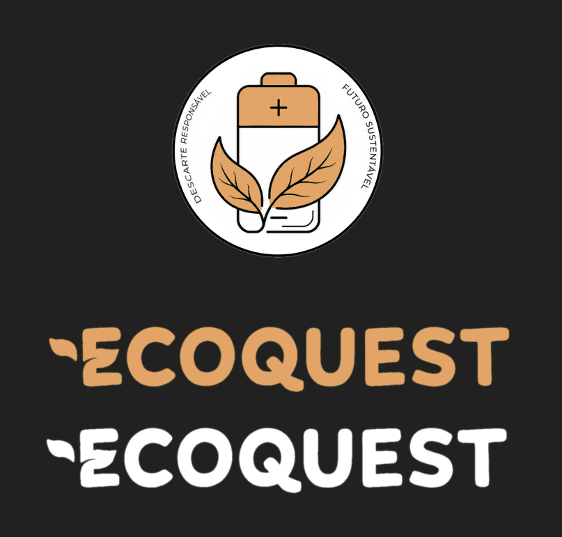
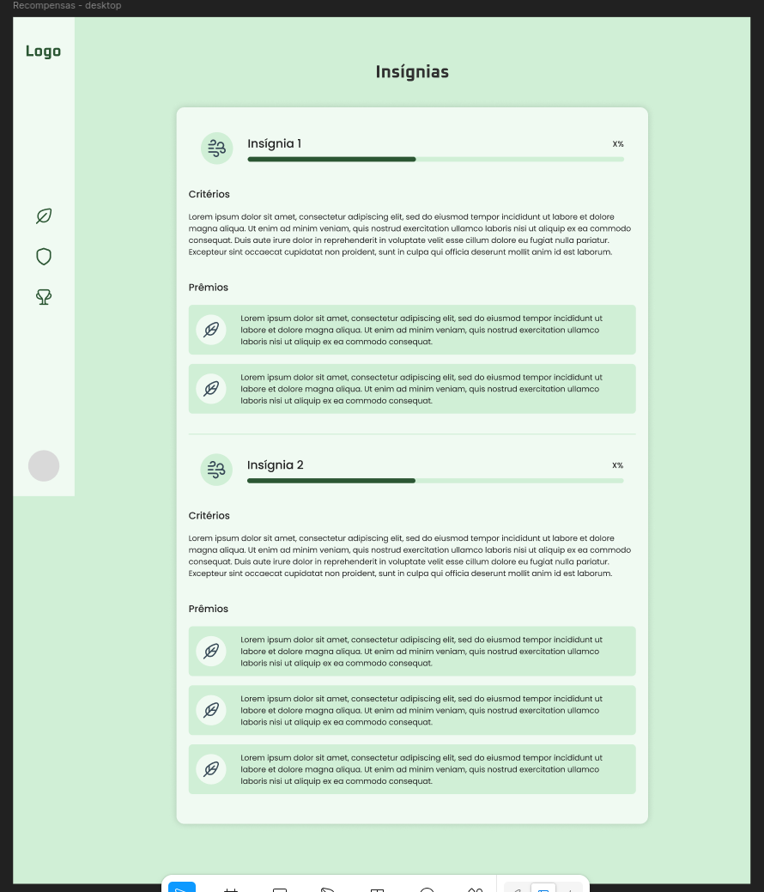

**Data:** 2026-06-04  
**Tipo:** Brainstorming  
**Formato:** Assíncrono  
**Participantes:** Prof. Juliana, João Victor, Nayra, Yasmim  
**Objetivo:** discutir identidade visual inicial (cores e símbolos) para logo e banner do EcoQuest.

**Atividade realizada:**
- Pesquisa de referências de ícones e símbolos representativos do projeto.
- Levantamento de opções de paleta: laranja, branco, preto e verde.
- Discussão de símbolos possíveis para a marca: bateria, reciclagem e prêmio.

**Decisões:**
- Construir dois protótipos de identidade visual com variações de cor para decisão da cliente.

**Artefatos influenciados:**
- Logo e banner verdes: 
- Logo e banner laranja: 
- Protótipo de alta fidelidade de recompensa (versão verde): 

**Resultados incorporados aos requisitos/artefatos:**
- Consolidação de decisões de interface e identidade visual para validação com stakeholder.
- Apoio ao refinamento dos requisitos de usabilidade e consistência visual.

**Ações:**
- Submeter as duas versões de identidade visual para validação da cliente.

**Chat:**

