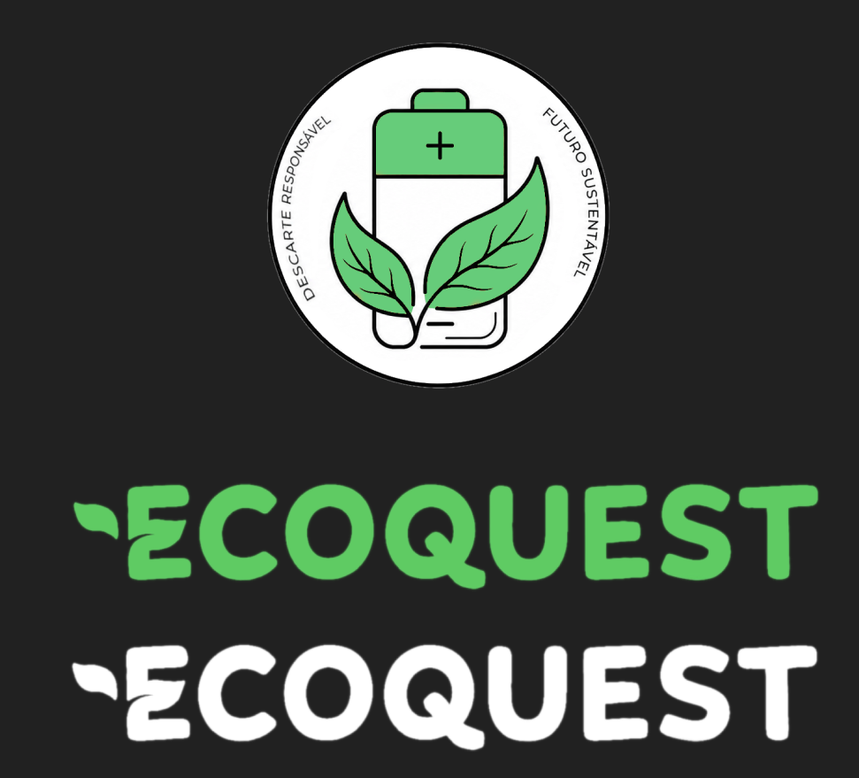

**Data:** 2026-06-12  
**Tipo:** Validação  
**Formato:** Assíncrono  
**Participantes:** Prof. Juliana, João Victor, Nayra, Yasmim  
**Objetivo:** validar versão final de identidade visual discutida no brainstorming de 04/06.

**Feedback da cliente:**
- A cliente validou as decisões de cor e logo discutidas na sessão de brainstorming de 04/06.

**Artefatos validados:**
- Logo em bateria verde com branco e preto
- Banner simples com folha lateral
- Arquivo validado: 
- Protótipos de Alta Fidelidade

**Resultados incorporados aos requisitos/artefatos:**
- Consolidação da identidade visual aprovada para uso nos materiais e protótipos.
- Fechamento da decisão de design para continuidade da implementação.

**Ações:**
- Aplicar a identidade validada nos artefatos visuais e na interface do projeto.

**Chat:**

Logo:

Prótotipos:

