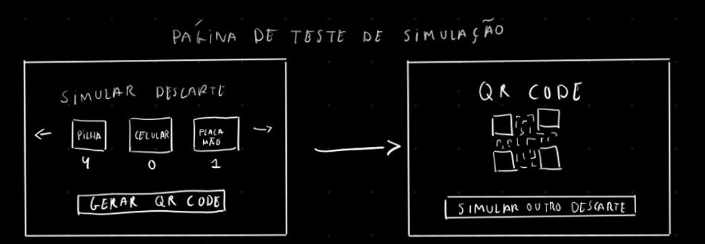

**Data:** 2026-05-13  
**Tipo:** Brainstorming  
**Formato:** Assíncrono  
**Participantes:** Proqf. Juliana, João Victor, Joaquim, Paulo  
**Objetivo:** idealizar fluxo da simulação de descarte e mecânica de recompensas do EcoQuest.

**Atividade realizada:**
- Discussão sobre o fluxo de simulação de descarte: página para seleção de itens descartáveis em PEV.
- Discussão sobre estratégias para simular premiações no sistema.

**Resultados:**
- Definição inicial do fluxo da simulação de descarte.
- Direcionamento para representação visual de recompensas em wireframes.

**Resultado incorporado:**
- Evolução dos wireframes de simulação e recompensas.

**Ações:**
- Consolidar fluxo no protótipo e validar com a cliente nas próximas iterações.
