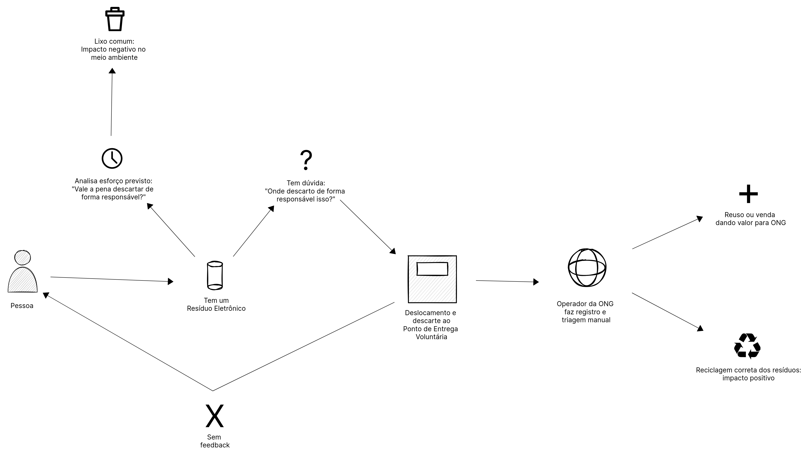
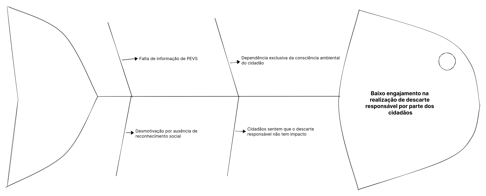
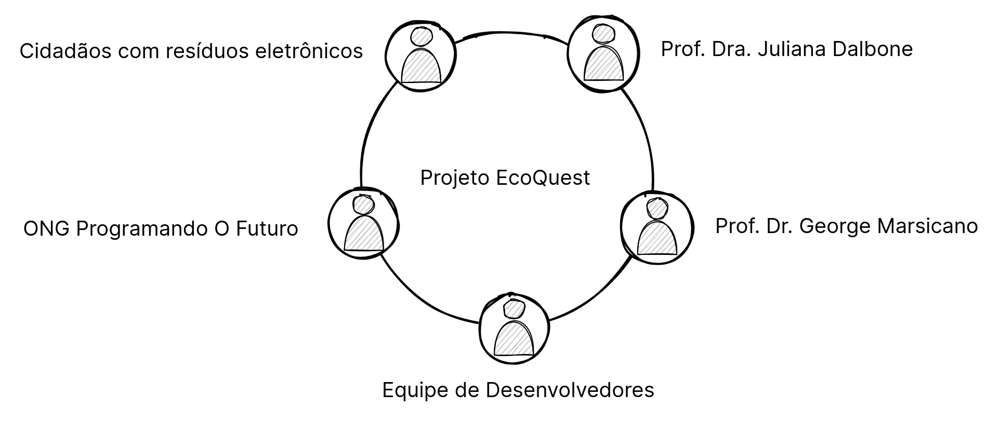

# 1. Cenário Atual e Negócio
## 1.1. Identificação do Cliente/Parceiro
|  | Descrição |
|----------|-----------|
| **Nome**     | Prof. Dra. Juliana Dalbone |
| **Tipo**     | Cliente Institucional/acadêmico |
| **Forma de Contato** | Reuniões de alinhamento quinzenais (remotas) e validações assíncronas semanais por e-mail institucional |
| **Vínculo com o projeto** | Principal Stakeholder. Responsável por orientar as regras de negócio, fases, e validar os requisitos elicitados e aprovar as entregas |

## 1.2. Introdução ao negócio e contexto

A gestão de Resíduos de Equipamentos Eletroeletrônicos (REEE) tornou-se um dos maiores desafios ambientais da década. No Distrito Federal, embora existam iniciativas isoladas, observa-se a ausência de uma rede integrada que conecte eficientemente o cidadão comum às entidades de reciclagem. O cenário atual é marcado por uma desconexão: de um lado, cidadãos que acumulam resíduos por não conhecerem pontos de coleta confiáveis; de outro, ONGs como a "Programando o Futuro", que possuem capacidade técnica de reciclagem, mas enfrentam dificuldades na captação constante e qualificada desses materiais. Redes de parceiros comerciais, que poderiam atuar como incentivadores, permanecem subutilizadas, criando um ciclo vicioso de baixa participação e impacto ambiental crescente.

O contexto atual exige uma transição do modelo de descarte baseado puramente no esforço individual para um sistema que reconheça e valorize a ação do cidadão, mitigando o impacto ambiental negativo causado pelo descarte inadequado no ecossistema local.

## 1.3. Rich Picture

## 1.4. Identificação da oportunidade ou problema

Observando modelos internacionais de sucesso que utilizam a reciprocidade para incentivar o descarte correto, identifica-se a oportunidade de transformar a percepção pública sobre o lixo eletrônico.

O problema central identificado é que **a alta fricção logística e a ausência de reciprocidade imediata criam uma "lacuna de altruísmo" sistêmica que desencoraja a participação ativa na gestão sustentável de resíduos**.

A análise das causas raiz mostrada na Figura 2, exibida abaixo, revela que o baixo índice de descarte adequado é sustentado pelos seguintes fatores:

## 1.5. Desafios do projeto

- **Desafios de Integridade**: Necessidade de mecanismos robustos para validar que a doação física ocorreu conforme declarado, evitando fraudes em sistemas de incentivo.

- **Desafios Logísticos**: Coordenação entre a disponibilidade do cidadão e a capacidade operacional de recebimento das ONGs e PEVs.

- **Desafios de Sustentabilidade Econômica**: Estruturação de parcerias que permitam a manutenção de recompensas e a viabilidade financeira da infraestrutura digital (servidores e manutenção).

- **Desafios de Retenção**: Converter a ação de descarte — que é naturalmente eventual — em um comportamento recorrente e consciente.

- **Desafio de Expansão Institucional**: Migrar de um MVP acadêmico para um projeto de extensão formalizado, garantindo a continuidade do desenvolvimento e a manutenção das parcerias externas após a fase inicial de implantação no campus.

## 1.6.Mapa de Stakeholders

Os principais stakeholders identificados no ecossistema de gestão de resíduos eletrônicos são:

| Stakeholder | Relação com a solução | Interesse principal | Influência |
|----------|-----------|-----------|---------------|
| Prof. Dra. Juliana Dalbone | Cliente e Orientadora | Validação do domínio ambiental e rigor metodológico | Alta |
| Prof. Dr. George Marsicano Correa | Cliente e Orientador | Aquisição dos conhecimentos de ER por parte da equipe desenvolvedora e a entrega da solução | Alta |
| Equipe de Desenvolvedores | Executores | Implementação técnica, segurança e escalável | Alta |
| Cidadãos (Doadores) | Usuários Finais | Facilidade de descarte, transparência e incentivos | Alta |
| ONGs (ex: Programando o Futuro) | Operadores Logísticos | Aumento do volume de captação e automação de triagem | Alta |
| Rede de Parceiros | Provedores de Incentivo | Responsabilidade social e visibilidade de marca | Média |

## 1.7. Segmentação de Clientes

A disciplina de Engenharia e Ambiente atende a um principal segmento de cliente:

- **Jovens Adultos (17-24 anos)**: Nativos digitais com alta circulação de dispositivos eletrônicos. Apresentam consciência ambiental teórica, mas são altamente sensíveis à conveniência e à gratificação imediata. A barreira principal para este grupo é o esforço logístico em comparação ao retorno percebido.

- **Idosos com Letramento Digital (60-70 anos)**: Grupo que costuma acumular equipamentos antigos por cautela ou falta de opção de descarte. Possuem interesse em contribuir para o bem comum, mas enfrentam barreiras na complexidade dos processos de descarte e na localização física dos pontos de entrega.