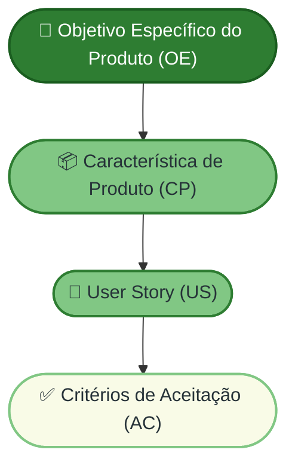
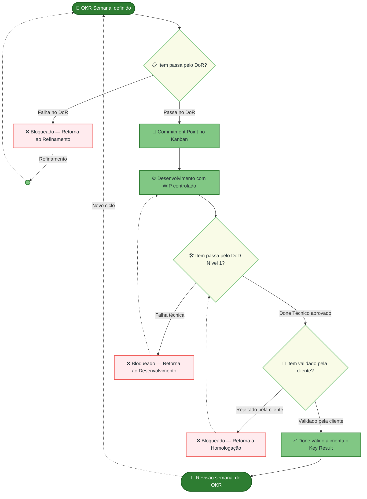

## Conceitos de Referência do Processo

Esta seção define os dois conceitos que aparecem como artefatos e
métricas ao longo de todas as dimensões do DoR e do DoD. Compreender
esses conceitos é pré-requisito para aplicar corretamente qualquer
critério descrito neste documento.

---

### O que são Critérios de Aceitação (ACs)

Critérios de Aceitação são condições verificáveis e inequívocas que
definem quando uma User Story foi implementada corretamente. Eles
funcionam como o contrato entre quem especifica o requisito e quem
o implementa: antes do desenvolvimento, estabelecem o que será
construído; após o desenvolvimento, estabelecem o que será testado.

**Formato padrão adotado:**

> *Dado* [um contexto inicial],
> *Quando* [uma ação é executada],
> *Então* [um resultado esperado e verificável ocorre].

**Cadeia de rastreabilidade obrigatória:**

Um AC sem rastreabilidade ao OE e CP correspondentes não é
um critério válido neste processo: ele desconecta a execução
técnica do propósito estratégico do produto.

**Referência:** Cohn, M. *User Stories Applied*. Addison-Wesley,
2004.

---

### O que são OKRs e como se conectam ao processo

OKR é um framework de definição e acompanhamento de metas composto
por dois elementos:

- **Objective (O):** Define *para onde* a equipe quer ir.
  É qualitativo, inspirador e com prazo definido.
- **Key Result (KR):** Define *como* a equipe saberá que chegou.
  É quantitativo, mensurável e falsificável — ou seja, ao final
  do ciclo, é possível dizer com certeza se foi atingido ou não.

**Referência:** Doerr, J. *Measure What Matters*. Portfolio/Penguin,
2018.

**Como os OKRs se conectam ao DoR e ao DoD neste processo:**

**Regra de contagem:** Um item só é contabilizado no progresso
de um Key Result se tiver cruzado o DoD Nível 2 — validação
pela cliente. Itens que passaram apenas pelo DoD Nível 1
(Done Técnico) estão em homologação e **não alimentam o KR**.
Essa regra garante que as métricas de OKR reflitam valor
entregue, não esforço despendido.

## Histórico de Versão

| Data | Versão | Descrição da Alteração | Autor(a) | Revisor(a) |
| :---: | :---: | :--- | :--- | :--- |
| 17/05/2026 | 0.1 | Criação do documento e estruturação dos tópicos iniciais. | Paulo Vitor | 
| 18//05/2026 | 1.0 | Adição de fluxos de trabalho e refinamento da estrutura do documento.| Paulo Vitor |