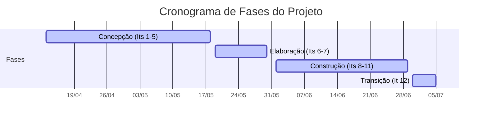

# 6. Cronograma e Entregas 

O cronograma do projeto EcoQuest opera em dois níveis de abstração distintos e complementares, garantindo a governança metodológica sem engessar a agilidade de desenvolvimento:

*   **Nível Macro (Este Documento):** Define a visão estratégica baseada nas fases do ciclo de vida do OpenUP. Estabelece os critérios de entrada, as condições de saída e os marcos de transição formais. Este nível é atualizado apenas na virada de fases ou mediante uma mudança de escopo aprovada.
    
*   **Nível Micro (GitHub Projects):** A gestão operacional do tempo e do esforço. Cada ciclo semanal é planejado, executado e rastreado diretamente no quadro Kanban do repositório, governado pelas regras de Definition of Ready (DoR) e Definition of Done (DoD). O detalhamento tático de iterações não é replicado neste documento para evitar desatualização e redundância.
    

> 🔗 **Acompanhamento e Organização:**
> 
> As iterações ativas, o burn rate de horas e o status de cada Caso de Uso podem ser auditados no nosso [Quadro de Iterações — GitHub Projects](https://github.com/orgs/mdsreq-fga-unb/projects/108).
> O monitoramento do MVP, rastreabilidade e critérios estão detalhados na página de [Planejamento e Organização](../planejamento-e-organizacao/README.md).

6.1. Visão Geral do Ciclo de Vida (OpenUP)
------------------------------------------
| Fase | Ciclos | Critério de Saída (Marco Arquitetural) | Status |
| :--- | :---: | :--- | :---: |
| **Concepção** | 1 – 5 | Escopo do MVP acordado com a cliente, Objetivos Específicos e Características de Produto (CPs) definidos, viabilidade técnica confirmada. | Concluída |
| **Elaboração** | 6 – 7 | Arquitetura técnica estabilizada, Casos de Uso prioritários especificados com priorização validada, riscos mitigados. | Concluída |
| **Construção** | 8 – 11 | Incrementos funcionais cruzando o DoD Nível 2 (validação da cliente), cobertura de testes ≥ 70%, versão Release Candidate em homologação. | Em andamento |
| **Transição** | 12 | Homologação final aprovada pela cliente, Deploy finalizado, Matriz de Rastreabilidade consolidada. | Pendente|

## 6.2. Detalhamento e Governança das Fases

---

### Fase de Concepção
**13 de Abril a 18 de Maio | Iterações 1 a 5**

> **Foco Estratégico:** Entendimento do domínio, definição do problema e viabilidade de negócio.

| Gatilho de Entrada | Artefatos de Saída (DoD da Fase) |
| :--- | :--- |
| Problema de negócio identificado e engajamento inicial da cliente. | <ul><li>Documento de Visão aprovado.</li><li>Objetivos Específicos (OEs) e Características de Produto (CPs) documentados.</li><li>Lista de Itens de Trabalho Geral inicial estabelecido com priorização MoSCoW.</li></ul> |

>**Registro Histórico de Mudança de Escopo:** Essa fase precisou ser estendida como consequência de uma mudança de escopo grande, que mudou o direcionamento do projeto e a ideação feita inicialmente (os critérios estão explicitados em documentação anterior de cenário atual da cliente).

**Marco de Transição:** Deadline da Unidade 2, juntamente com uma estabilização de escopo e definição de critérios de trabalho e priorização.

---

### Fase de Elaboração
**19 de Maio a 30 de Maio | Iterações 6 e 7**

*   **Gatilho de Entrada:** Arquitetura validada no Marco de Elaboração e itens prioritários da Lista de Itens de Trabalho cruzando o ponto de compromisso (_DoR_).
    
*   **Artefatos de Saída (DoD da Fase):**
    
    *   100% dos Casos de Uso compromissados para o MVP no status _Done de Negócio_ (DoD Nível 2).
        
    *   Taxa de cobertura de testes unitários atingindo a restrição arquitetural 70%.
        
    *   Versão _Release Candidate_ (RC) implantada em ambiente de homologação.
        
*   **Marco de Transição:** Marco de Capacidade Operacional Inicial — O software é capaz de executar seus fluxos críticos na mão dos primeiros usuáriose possível fluxo validado pelos stackholders.
    

| Gatilho de Entrada | Artefatos de Saída (DoD da Fase) |
| :--- | :--- |
| Marco da Concepção validado. | <ul><li>Arquitetura técnica estável e integrada ao pipeline.</li><li>Casos de Uso prioritários detalhados com priorização validada.</li><li>Protótipos visuais de interface aprovados.</li><li>Filtros arquiteturais (_Definition of Ready_ e _Definition of Done_) testados no fluxo de trabalho.</li></ul> |

**Marco de Transição:** Marco de Arquitetura do Ciclo de Vida — A fundação técnica suporta a escala da construção, validação sobre os protótipos visuais e fluxo de trabalho bem definido.

---

### Fase de Construção
**01 de Junho a 29 de Junho | Iterações 8 a 11**

> **Foco Estratégico:** Desenvolvimento em fluxo contínuo governado, garantindo qualidade técnica e validação incremental.

| Gatilho de Entrada | Artefatos de Saída (DoD da Fase) |
| :--- | :--- |
| Arquitetura validada no Marco de Elaboração e itens do topo do backlog cruzando o ponto de compromisso (_DoR_). | <ul><li>100% dos Casos de Uso compromissados para o MVP no status Done de Negócio (DoD Nível 2).</li><li>Taxa de cobertura de testes unitários atingindo a restrição arquitetural de 70%.</li><li>Versão Release Candidate (RC) implantada em ambiente de homologação.</li></ul> |

**Marco de Transição:** Marco de Capacidade Operacional Inicial — O software é capaz de executar seus fluxos críticos na mão dos primeiros usuários e possível fluxo validado pelos stakeholders.

---

### Fase de Transição
**30 de Junho a 5 de Julho | Iteração 12**

> **Foco Estratégico:** Homologação em campo, polimento final, correção de anomalias e entrega de valor.

| Gatilho de Entrada | Artefatos de Saída (DoD da Fase) |
| :--- | :--- |
| _Release Candidate_ operando sem bugs críticos impeditivos. | <ul><li>Termo de aceite/homologação final validado com a cliente.</li><li>Sistema já funcional em espaço de teste e pronto para deploy.</li><li>Documentação técnica final e Matriz de Rastreabilidade atualizadas.</li></ul> |

**Marco de Transição:** Marco de Liberação do Produto — Encerramento técnico da versão atual do projeto.

6.3. Andamento do Projeto em Relação ao Cronograma
------------------------------------------

<iframe
style="border: 1px solid rgba(0, 0, 0, 0.1);"0, 0, 0, 0.1);"
width="800" 
height="450" 
src="https://embed.figma.com/board/f6CjlyYaVd3bPZBigmWU9o/Untitled?node-id=0-1&embed-host=share" 
allowfullscreen>
</iframe>
    

6.4. Política de Gerenciamento de Mudanças
------------------------------------------

Para proteger a integridade desta documentação e evitar o engessamento gerencial, este cronograma macro é atualizado mediante os seguintes eventos:

1.  Conclusão formal de uma fase e passagem pelo seu respectivo marco.
    
2.  Alteração profunda de escopo de negócio ou pivotamento de estratégia validado pela cliente.
    
3.  Replanejamento estrutural de fase gerado pela materialização de um risco crítico.
    

**Considerações sobre o cronograma:**
O projeto é guiado por liberações progressivas de valor. Essa estratégia de fatiamento garante que a mitigação de riscos operacionais, especialmente no que tange ao engajamento prático do jovem na plataforma, seja aferida continuamente através do uso real da aplicação, permitindo ajustes de rota e refinamentos na Lista de Itens de Trabalho antes do lançamento final do MVP.

## Histórico de Versão

| Data | Versão | Descrição da Alteração | Autor(a) |
|-------|-------|------|------|
| 12/04/2026 | 1.0 | Criação do documento e estruturação dos inicial. | Paulo Vitor |
| 26/05/2026 | 2.0 | Mudanças na estrutura pensando numa melhor conformidade com o andamento do projeto.| Paulo Vitor |
| 14/06/2026 | 2.1 | Ajuste terminológico para Lista de Itens de Trabalho e alinhamento com o processo praticado. | João Victor |
| 15/06/2026 | 2.2 | Adição do andamento do projeto em relação ao cronograma. | Paulo Vitor |
