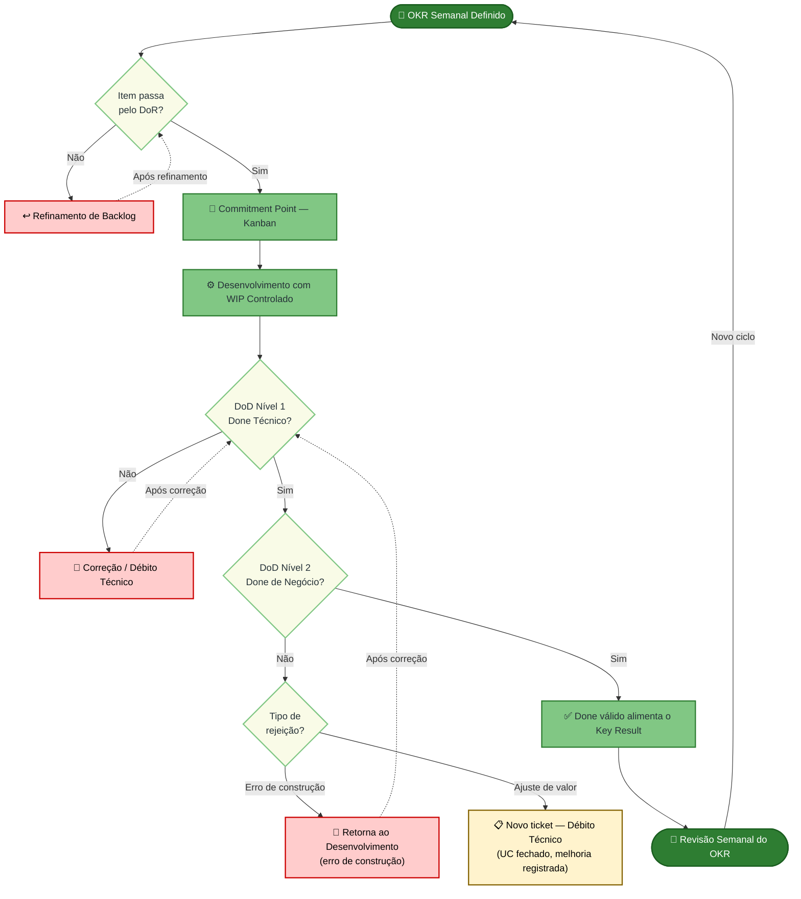

# DoR e DoD

Checklists de **Definition of Ready (DoR)** e **Definition of Done (DoD)** para itens do backlog (*Work Items List*).

Cada requisito deve indicar **OE** e **CP** (ver [Solução Proposta](/solucao-proposta/)).

## DoR (Ready)

Um item só cruza o Commitment Point do Kanban se todas as perguntas abaixo forem respondidas com **Sim**. A resposta **Não** será tratada dentro de duas esferas: a nível de equipe, o item volta para refinamento; a nível individual, será aberta uma issue de estudo.

#### Dimensão de Clareza

_Verifica se o "o quê" e o "por quê" estão absolutamente claros para toda a equipe._

> - O ator, qualquer entidade externa ao sistema que interage com ele para atingir um objetivo, está nomeado, seu papel está descrito e seu objetivo de negócio está explícito no Caso de Uso?
> - O IP foi calculado, o quadrante definido e a classificação MoSCoW registrada no backlog?
> - Os critérios de aceitação — condições verificáveis que definem as formas de uso das funcionalidades implementadas no UC — existem e estão ligados ao OE e CP correspondentes?
> - As regras de negócio estão devidamente verificadas dentro do contexto? _(Critério de completude do contexto de negócio, especialmente para lógicas de gamificação: missões, tokens, progressão e recompensas.)_
> - O validador, o canal de validação e o critério de aprovação estão definidos e registrados no UC?

#### Dimensão de Viabilidade

_Garante que não existem bloqueadores externos, de infraestrutura ou de dependência sistêmica que impeçam o início imediato e a fluidez do desenvolvimento._

> - As dependências técnicas foram mapeadas?
> - Os impedimentos conhecidos foram removidos ou possuem plano de mitigação documentado?

#### Dimensão de Estimabilidade

_Confirma que a equipe possui domínio técnico e informação suficiente para prever o esforço e assumir um compromisso responsável._

> - Os critérios de aceitação são específicos o suficiente para que a equipe estime o esforço com precisão?
> - O INVEST _(Independent, Negotiable, Valuable, Estimable, Small, Testable)_ passou sem ressalvas de nenhum membro da equipe?
> - Conseguimos estimar o tempo total, incluindo o ciclo de validação com a cliente?

#### Dimensão de Escopo

_Garante o alinhamento mental compartilhado sobre a solução e se o tamanho do trabalho cabe no ciclo de entrega._

> - O escopo cabe em uma iteração?
> - Cada membro consegue dizer exatamente o que vai construir, como vai testar e em quanto tempo, sem fazer perguntas adicionais? Se não, o que especificamente está faltando?
> - As dependências entre itens foram mapeadas e os itens dependentes estão concluídos ou há acordo explícito sobre como proceder?

---

## DoD — Definition of Done (Pronto para Entregar)

Para que um item saia do fluxo ativo de desenvolvimento, ele deve obrigatoriamente cruzar duas barreiras de qualidade: o **DoD Nível 1 (Done Técnico)** e o **DoD Nível 2 (Done de Negócio)**.

### DoD Nível 1 — Done Técnico (Pronto para Homologação)

_Atesta que o código foi construído com excelência técnica, integrado sem quebras e está disponível no ambiente de testes._

#### Dimensão de Completude Funcional (RF)

- [ ] Todos os fluxos principais, alternativos e de exceção descritos no Caso de Uso foram implementados.
- [ ] Cenários de falha (ex: instabilidade externa, dados inválidos) possuem tratamento de erro com feedback amigável ao usuário.
- [ ] O código implementado atende integralmente a todos os Critérios de Aceitação (ACs) definidos no DoR.
- [ ] O comportamento funcional da interface atende integralmente aos ACs, independentemente de variações visuais em relação ao Design System.

#### Dimensão de Qualidade Técnica (RNF)

- [ ] Os RNFs possuem parâmetros mensuráveis definidos?
- [ ] Os parâmetros mensuráveis definidos nos Requisitos Não Funcionais (Desempenho, Segurança, Usabilidade) deste UC foram aferidos e aprovados.
- [ ] O código passou sem alertas críticos pelas ferramentas de análise estática configuradas no pipeline (nenhuma vulnerabilidade grave introduzida).

#### Dimensão de Validação Interna

- [ ] Testes unitários foram escritos com estrutura clara (ex: AAA — _Arrange, Act, Assert_) e instâncias de substituição adequadas (_Mocks/Spies_) para dependências externas.
- [ ] A taxa de cobertura de código (_Code Coverage_) da funcionalidade atingiu a métrica mínima de 70%.
- [ ] O _Pull Request_ foi aprovado após revisão de código (_Code Review_) por outro membro da equipe.

#### Dimensão de Integração e Documentação

- [ ] A rastreabilidade bidirecional (OE → CP → UC → Backlog → AC → Validação → Entrega) foi mapeada e atualizada na ferramenta de gestão.
- [ ] A documentação técnica relevante (decisões de arquitetura, diagramas UML, mudanças de banco de dados) foi atualizada na GitHub Pages oficial do projeto.
- [ ] O código da _feature branch_ foi integrado na branch principal sem conflitos e o _build_ no servidor de CI passou integralmente.
- [ ] O incremento de software foi implantado (_deploy_) com sucesso no ambiente de Homologação/Staging.

---

### DoD Nível 2 — Done de Negócio (Validado)

_Atestado de forma síncrona ou assíncrona junto à cliente. É o gatilho final que arquiva o card no Kanban e libera a métrica para os OKRs._

#### Dimensão de Validação de Valor

- [ ] A funcionalidade foi inspecionada pela cliente no ambiente de Homologação.
- [ ] A regra de escopo da validação foi respeitada:
    - Se núcleo de funcionalidade menor ou protótipo → Validação **Assíncrona** aprovada.
    - Se regra de negócio complexa ou conjunto funcional composto por 3 ou mais Casos de Uso — dado que esse volume já compõe um núcleo funcional denso da aplicação — → Validação **Síncrona** (reunião/demonstração) realizada e aprovada.
- [ ] O incremento gerou o comportamento de negócio esperado, liberando a métrica para alimentar os _Key Results_ (KRs) do ciclo atual.

---

## Uso no Processo

---

## Histórico de Versão

| Data | Versão | Descrição da Alteração | Autor(a) |
|-------|-------|------|------|
| 02/05/2026 | 0.1 | Criação do documento e estruturação dos tópicos iniciais. | João Vitor | 
| 17/05/2026 | 1.0 | Inclusão das dimensões e domínios no DoR. | Paulo Vitor | 
| 18//05/2026 | 1.1 | Inclusão das dimensões e domínios do DoD.| Paulo Vitor |