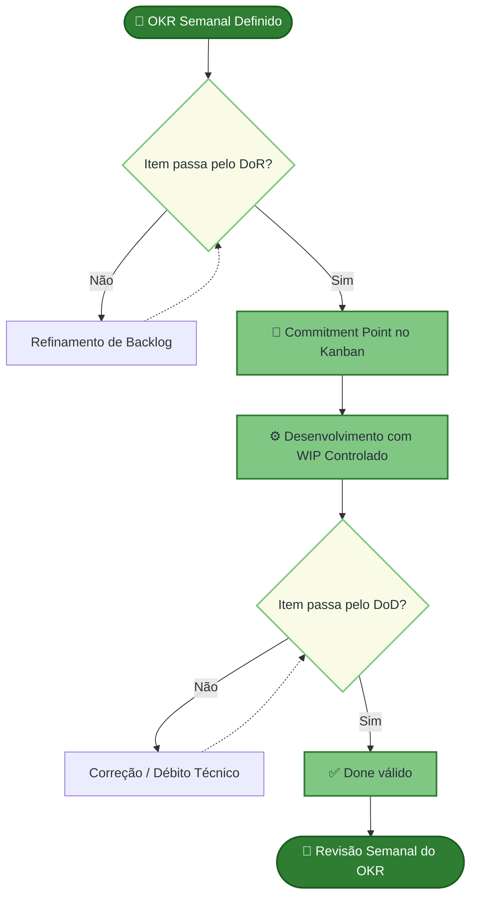

# DoR e DoD

Checklists de **Definition of Ready (DoR)** e **Definition of Done (DoD)** para itens do backlog (*Work Items List*).

Cada requisito deve indicar **OE** e **CP** (ver [Solução Proposta](../solucao-proposta/)).

## DoR (Ready)

- Dimensão de Clareza: 
> - O ator, qualquer entidade externa ao sistema que interage com ele para atingir um objetivo, está nomeado, seu papel está descrito e seu objetivo de negócio está explícito no item ? Todos devem ter plena clareza daquilo que deverá ser desenvolvido. 
> - O IP foi calculado e o quadrante definido ?
> - Os critérios de aceite, lista de itens de negócio que apresentam as formas de usar as funcionalidades implementadas na US, existem e estão ligados ao objetivo ?
>  - A classificação MoSCoW da US em si está definida e registrada no backlog ?
> - Regras de negócios devidamente verificadas dentro do contexto ? Critério de completude do contexto de negócio.
> - Sabemos o que 'aprovado' significa e quem aprova ?
-Dimensão de Viabilidade: 
> - As dependências técnicas foram mapeadas ?
> - Os impedimentos conhecidos foram removidos ou possuem plano de mitigação documentado ? 
-Dimensão de Estimabilidade: 
> - Os critérios de aceite são específicos o suficiente para que a equipe estime o esforço com precisão ? 
> - O INVEST(*Independent, Negotiable, Valuable, Estimable, Small, Testable*) passou sem ressalvas de nenhum membro da equipe ? 
> - Conseguimos estimar o tempo total incluindo o ciclo de validação com a cliente ?
-Dimensão de Escopo: 
> - O escopo cabe em uma iteração ? 
> - Entendimento compartilhado de cada parte e de como aquilo contribui para um todo. Para que possamos verificar o nível de entendimento e responder a pergunta "Para cada item que queremos mover para o fluxo ativo essa semana: cada um aqui consegue me dizer exatamente o que vai construir, como vai testar, e em quanto tempo, sem fazer nenhuma pergunta ? Se não, o que especificamente está faltando ? 
> - Caso seja não seja possível responder como equipe o item volta para refinamento, se for a nível individual será aberta uma issue para estudo/verificação.
> - As dependências entre itens foram mapeadas e os itens dependentes estão concluídos ou há acordo explícito sobre como proceder ?

## DoD (Done)

### DoD Nível 1: Done Técnico (Pronto para Homologação)

_Este nível atesta que o código foi construído com excelência técnica, integrado sem quebras e está disponível no ambiente de testes._

**1\. Dimensão de Completude Funcional (RF):**

*   \[ \] Todos os fluxos principais, alternativos e de **exceção** descritos na US/Caso de Uso foram implementados.
    
*   \[ \] Cenários de falha (ex: instabilidade externa, dados inválidos) possuem tratamento de erro com feedback amigável ao usuário.
    
*   \[ \] O código implementado atende integralmente a todos os Critérios de Aceitação (ACs) estipulados no DoR.
    
*   \[ \] O comportamento funcional da interface atende integralmente aos critérios de aceite, independentemente de variações visuais em relação ao Design System?"
    

**2\. Dimensão de Qualidade Técnica (RNF):**

*   \[ \] Os parâmetros mensuráveis definidos individualmente nos Requisitos Não Funcionais (Desempenho, Segurança, Usabilidade) da US foram aferidos e aprovados.
    
*   \[ \] O código passou sem alertas críticos pelas ferramentas de análise estática configuradas no pipeline do **GitHub Actions** (nenhuma vulnerabilidade grave introduzida).
    

**3\. Dimensão de Cobertura e Validação Interna:**

*   \[ \] Testes unitários foram escritos utilizando estrutura clara (ex: AAA) e instâncias de substituição adequadas (_Mocks/Spies_) para dependências externas.
    
*   \[ \] A taxa de cobertura de código (_Code Coverage_) da funcionalidade atingiu a **métrica mínima exigida de 70%**.
    
*   \[ \] O _Pull Request_ foi aprovado após uma revisão de código (_Code Review_) assíncrona por outro membro da equipe.
    

**4\. Dimensão de Integração e Documentação:**

*   \[ \] A rastreabilidade bidirecional (Backlog → US → OE/CP → AC) foi devidamente mapeada e atualizada na ferramenta de gestão.
    
*   \[ \] A documentação técnica relevante (decisões de arquitetura, diagramas UML, mudanças de banco de dados) foi atualizada diretamente na **GitHub Pages** oficial do projeto.
    
*   \[ \] O código da _feature branch_ foi integrado na branch principal sem conflitos e o _build_ no servidor de CI (GitHub Actions) passou integralmente.
    
*   \[ \] O incremento de software foi implantado (_deploy_) com sucesso no ambiente de Homologação/Staging.
    

### DoD Nível 2: Done de Negócio (Validado)

_Este nível é atestado de forma síncrona ou assíncrona junto à cliente. É o gatilho final que arquiva o card no Kanban e permite a coleta de dados para os OKRs._

**5\. Dimensão de Validação de Valor:**

*   \[ \] A funcionalidade foi inspecionada pela cliente no ambiente de Homologação.
    
*   \[ \] **Regra de Escopo da Validação:**
    
    *   Se for núcleo de funcionalidade menor/protótipo ➔ Validação Assíncrona aprovada.
        
    *   (Validar) Se for regra de negócio complexa ou conjunto funcional maior que 3 US ➔ Validação Síncrona (reunião/demonstração) realizada e aprovada.
        
*   \[ \] O incremento gerou o comportamento de negócio esperado, liberando a métrica para alimentar os _Key Results_ (KRs) do ciclo atual.

## Uso no processo

## Histórico de Versão

| Data | Versão | Descrição da Alteração | Autor(a) |
|-------|-------|------|------|
| 02/05/2026 | 0.1 | Criação do documento e estruturação dos tópicos iniciais. | João Vitor | 
| 17/05/2026 | 1.0 | Inclusão das dimensões e domínios no DoR. | Paulo Vitor | 
| 18//05/2026 | 1.1 | Inclusão das dimensões e domínios do DoD.| Paulo Vitor |