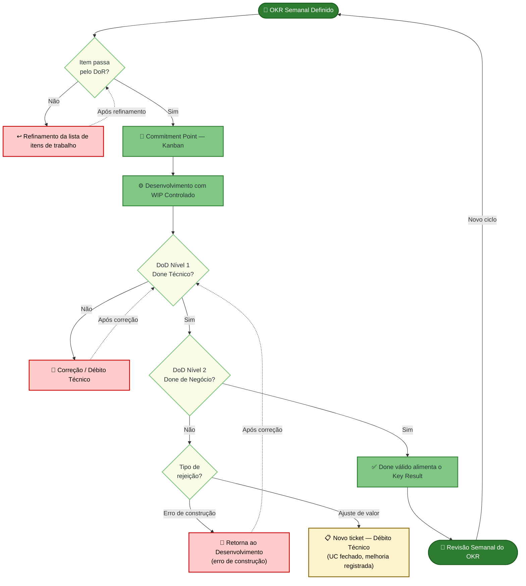

## 4.1 Atividades e Técnicas de ER

### Elicitação e Descoberta

- **Entrevistas com cliente:** utilizadas para compreender o problema do baixo engajamento em práticas sustentáveis, levantar necessidades do sistema e identificar expectativas em relação à solução proposta.
- **Brainstorming:** utilizado pela equipe para discutir ideias de funcionalidades e estratégias de gamificação adequadas ao contexto do EcoQuest.
- **Análise de domínio:** utilizada para compreender melhor o contexto acadêmico e ambiental do projeto, garantindo que os requisitos estejam alinhados ao propósito da solução.

### Análise e Consenso

- **Discussões em equipe:** utilizadas para alinhar o entendimento sobre os requisitos levantados e avaliar sua viabilidade no contexto do projeto.
- **Priorização MoSCoW:** utilizada para classificar os requisitos conforme sua importância para o MVP, distinguindo funcionalidades essenciais das desejáveis.
- **Análise de custo-benefício:** utilizada para apoiar decisões sobre o escopo da solução, considerando esforço, valor entregue e limitações do projeto.

### Declaração de Requisitos

- **Casos de Uso:** utilizados como artefato principal para descrever comportamento do sistema por meio de fluxo principal, alternativos e de exceção.
- **Casos de Uso de alto nível:** utilizados para consolidar o entendimento funcional e orientar o detalhamento incremental dos requisitos.
- **Critérios de Aceitação + DoR/DoD:** utilizados para definir condições verificáveis de prontidão, implementação e validação junto aos stakeholders.

O projeto não adota Histórias de Usuário como artefato principal. A equipe optou por trabalhar com **Casos de Uso + Critérios de Aceitação**, por aderência a terminologia correta do processo e à necessidade de explicitar regras de negócio com maior detalhamento.

Para manter consistência entre ER e desenvolvimento, o projeto utiliza **DoR/DoD** como critérios de prontidão e conclusão dos requisitos, conectando cada caso de uso aos objetivos (OE) e às características do produto (CP). As checklists estão em [DoR e DoD](../dor-e-dod/).

### Representação de Requisitos

- **Protótipos:** utilizados para representar visualmente as principais funcionalidades do sistema antes da implementação.
- **Wireframes:** utilizados para estruturar as telas e os fluxos de navegação do EcoQuest.
- **Fluxos em Casos de Uso:** utilizados para explicitar cenários principal, alternativos e de exceção, reduzindo ambiguidades na implementação.

Foi feito um ajuste para que ao invés de usar Diagrama UML, a equipe optou por utilizar **protótipos e wireframes** como artefatos de representação visual, por serem mais adequados para validar a interface e a experiência do usuário, além de facilitar a comunicação com stakeholders não técnicos.

### Organização e Atualização de Requisitos

- **Checklist:** garantir que os itens da lista de itens de trabalho estejam claros, sem ambiguidade, completos, verificáveis, consistentes, rastreáveis e com entendimento compartilhado entre equipe e cliente.
- **Refinamento e controle dos requisitos:** realizado de forma contínua durante as iterações, com revisão de prioridade (MoSCoW), análise de impacto em OE/CP, ajuste de critérios de aceitação e atualização da documentação/atas sempre que houver mudança aprovada.

### Verificação e Validação de Requisitos

- **DoR (Definition of Ready):** utilizado para verificar se os requisitos estão claros, completos, consistentes, rastreáveis e prontos para seguir no fluxo de desenvolvimento. O DoR confirma se cada item possui objetivo, ator, prioridade, regras de negócio e relação com OE e CP antes de ser assumido pela equipe.
- **Feedback com stakeholders:** utilizado para validar se os requisitos refletem corretamente as necessidades da cliente e dos demais stakeholders do EcoQuest.
- **Testes:** utilizados posteriormente para verificar se as funcionalidades implementadas atendem aos requisitos e critérios de aceitação definidos.

## 4.2 Engenharia de Requisitos e o OpenUP

A Engenharia de Requisitos (ER) do projeto foi estruturada em alinhamento com o processo **OpenUP**  e com a abordagem híbrida definida. Dessa forma, as atividades de ER são realizadas de forma iterativa e incremental, com maior foco exploratório nas fases iniciais e maior formalização e controle nas fases posteriores.

Considerando o contexto do projeto, uma plataforma gamificada voltada ao engajamento em práticas sustentáveis, as atividades de ER também priorizam a validação contínua com stakeholders e a mitigação de riscos, especialmente relacionados à validação de atividades e ao engajamento dos usuários.

A tabela a seguir apresenta o mapeamento entre as fases do OpenUP, as atividades de ER, práticas, técnicas e os resultados esperados.

| Fases do Processo | Atividades ER | Prática | Técnica | Resultado Esperado |
|------------------|--------------|--------|--------|-------------------|
| **Concepção** | Elicitação e Descoberta | Levantamento inicial de requisitos | Entrevistas com cliente, Brainstorming | Identificação do problema dos requisitos iniciais |
|  | Análise e Consenso | Alinhamento com stakeholders | Discussões em equipe, Priorização MoSCoW | Priorização das funcionalidades essenciais |
|  | Declaração de Requisitos | Formalização inicial | Casos de Uso de alto nível, critérios de aceitação iniciais | Registro inicial de funcionalidades e regras principais |
|  | Organização e Atualização | Estruturação inicial | Criação da lista de itens de trabalho | Lista de itens de trabalho inicial alinhada a OE/CP |
|  | Verificação e Validação | Avaliação inicial dos requisitos | Revisão interna + feedback com stakeholder | Confirmação de entendimento compartilhado e viabilidade inicial |
| **Elaboração** | Representação de Requisitos | Modelagem da solução | Protótipos e wireframes | Visualização dos fluxos de navegação e interação |
|  | Declaração de Requisitos | Detalhamento funcional | Casos de Uso com fluxos principal, alternativos e de exceção | Requisitos aptos para implementação incremental |
|  | Organização e Atualização | Refinamento contínuo | Atualização da lista de itens de trabalho, versionamento e critérios | Requisitos refinados e priorizados para construção |
|  | Verificação e Validação | Validação incremental | Feedback assíncrono/síncrono com stakeholders | Ajustes incorporados com evidência em atas |
| **Construção** | Elicitação e Descoberta | Descoberta de ajustes durante implementação | Feedback de uso e revisões com stakeholder | Identificação de lacunas e novos ajustes de requisito |
|  | Declaração de Requisitos | Atualização da especificação | Ajuste de casos de uso, critérios e regras de negócio | Requisitos mantidos coerentes com decisões da iteração |
|  | Verificação e Validação | Conferência de incrementos | DoR/DoD, testes funcionais e validação com cliente | Garantia de aderência entre requisito e incremento entregue |
|  | Organização e Atualização | Controle de mudanças | Atualização da lista de itens de trabalho e atas | Evolução rastreável das decisões e mudanças |
| **Transição** | Validação com stakeholder |Aceite final |  Revisão final com cliente e validação de artefatos | Confirmação de aderência da solução aos objetivos do projeto |
|  | Organização e Atualização | Consolidação final | Consolidação documental de requisitos e evidências | Requisitos formalizados, rastreáveis e auditáveis |

## 4.3 Evidências de Execução das Técnicas de ER

As evidências das técnicas previstas na estratégia estão registradas no diretório [Atas](/atas/), com participantes, data, objetivo, decisões e resultados vinculados aos artefatos.

### Entrevistas

- Evidência: [08/05/2026 - Entrevista inicial e definição de fluxo de comunicação](/atas/08-05.md)
- Resultado incorporado: definição do canal assíncrono para validação, ajuste de escopo e alinhamento da estratégia do MVP.

### Brainstorming

- Evidências: [13/05/2026 - Brainstorming de fluxo de simulação e recompensas](/atas/13-05.md), [04/06/2026 - Brainstorming de identidade visual](/atas/04-06-brainstorming.md)
- Resultado incorporado: definição e refinamento de fluxos funcionais e variações visuais para validação com stakeholder.

### Análise de domínio e análise de custo-benefício

- Adaptação realizada: essas técnicas não foram conduzidas como atividades isoladas com documento próprio.
- Forma praticada pela equipe: foram incorporadas às validações e discussões de priorização (MoSCoW) registradas nas atas.
- Evidência de decisão de escopo/priorização: [16/05/2026 - Validação de terminologia, regras de negócio e foco do MVP](/atas/16-05.md).

### Validação e Feedback com Stakeholders

As validações com a cliente foram conduzidas de forma assíncrona (WhatsApp/e-mail) conforme canal definido em conjunto, abrangendo diferentes tipos de artefato ao longo das iterações. A tabela a seguir sintetiza as validações realizadas por incremento/UC.

| Data | Tipo de Validação | Incremento Apresentado | UC/RF | Feedback da Cliente | Decisão | Status | Ata |
|------|-------------------|----------------------|-------|--------------------|---------|--------|-----|
| 16/05/2026 | Validação de regra de negócio | Terminologia de domínio, regras de negócio e priorização do MVP | — (requisitos gerais) | Sugeriu alteração de "doação" para "descarte sustentável e responsável"; "resíduos especializados" para "resíduos potencial contaminantes"; priorizar gamificação sobre localização de PEVs; precificação dinâmica aceita como regra de negócio | CR-1 a CR-4 registrados e incorporados | Aprovado com ressalvas | [🔗](/atas/16-05.md) |
| 17/05/2026 | Validação de protótipo | Wireframe de simulação de descarte | UC08 / RF08 | Wireframe aprovado, com ajustes de navegação e clareza do fluxo solicitados | Aplicar ajustes de refinamento visual e avançar para próximas validações | Aprovado com ressalvas | [🔗](/atas/17-05.md) |
| 04/06/2026 | Validação de protótipo | Wireframes de insígnias, prêmios, navegação e ranking | UC01, UC02, UC08, UC09, UC10, UC11, UC12, UC15 | Conjunto de wireframes validado para continuidade no refinamento | Prosseguir com refinamentos visuais e atualização de requisitos associados | Aprovado com ressalvas | [🔗](/atas/04-06-validacao.md) |
| 12/06/2026 | Validação de protótipo | Identidade visual final (logo e banner) | — (identidade visual) | Decisões de cor e logo validadas conforme discutido no brainstorming de 04/06 | Consolidar identidade visual aprovada para uso nos materiais e protótipos | Aprovado | [🔗](/atas/12-06.md) |
| 30/06/2026 | Validação de incremento funcional | MVP completo — Cadastro, Autenticação, Localização de PEVs, Leitura de Token, Extrato, Catálogo de Recompensas, Resgate, Vitrine de Conquistas e Ranking | UC01, UC02, UC06, UC08, UC09, UC10, UC11, UC12, UC15 | Aprovado, repetiu o comentário, "Excelente." e que agora planeja transformar o projeto em um projeto de extensão da universidade | MVP aprovado pela cliente para continuidade e evolução do projeto | Aprovado | [🔗](/atas/30-06.md) |

## Monitoramento da Execução de Engenharia de Requisitos

Cadência definida: a cada 14 dias.

Objetivo do monitoramento: verificar se as atividades previstas de ER foram executadas, se houve resultado incorporado aos requisitos e se existe evidência auditável no repositório.

Template de registro quinzenal:

- **Período:**
- **Atividade prevista:** monitoramento da execução das atividades de Engenharia de Requisitos na quinzena.
- **Técnica utilizada:** revisão técnica documental e verificação de completude das atas/evidências.
- **Responsável:**
- **Resultado obtido:**
- **Evidência produzida:**

### Registro Q1 (13/06/2026)

- **Período:** 08/05/2026 a 13/06/2026.
- **Atividade prevista:** monitoramento da execução das atividades de Engenharia de Requisitos na quinzena.
- **Técnica utilizada:** revisão técnica documental e completude das atas.
- **Responsável:** João Victor.
- **Resultado obtido:** inclusão e consolidação de evidências de ER com foco em validação, brainstorming e entrevista.
- **Evidência produzida:** atas de entrevista, brainstorming e validação; artefatos visuais (protótipos e wireframes) vinculados às decisões registradas

## DoR e DoD

Checklists de **Definition of Ready (DoR)** e **Definition of Done (DoD)** para a lista de itens de trabalho.

Cada requisito deve indicar **OE** e **CP** (ver [Solução Proposta](/solucao-proposta/)).

### DoR (Ready)

Um item só cruza o Commitment Point do Kanban se todas as perguntas abaixo forem respondidas com **Sim**. A resposta **Não** será tratada dentro de duas esferas: a nível de equipe, o item volta para refinamento; a nível individual, será aberta uma issue de estudo.

#### Dimensão de Clareza

_Verifica se o "o quê" e o "por quê" estão absolutamente claros para toda a equipe._

> - O ator, qualquer entidade externa ao sistema que interage com ele para atingir um objetivo, está nomeado, seu papel está descrito e seu objetivo de negócio está explícito no Caso de Uso?
> - O IP foi calculado, o quadrante definido e a classificação MoSCoW registrada na lista de itens de trabalho ?
> - Os critérios de aceitação — condições verificáveis que definem as formas de uso das funcionalidades implementadas no UC, existem e estão ligados ao OE e CP correspondentes?
> - As regras de negócio estão devidamente verificadas dentro do contexto? _(Critério de completude do contexto de negócio, especialmente para lógicas de gamificação: missões, tokens, progressão e recompensas.)_
> - O validador, o canal de validação e o critério de aprovação estão definidos e registrados no UC?

#### Dimensão de Viabilidade

_Garante que não existem bloqueadores externos, de infraestrutura ou de dependência sistêmica que impeçam o início imediato e a fluidez do desenvolvimento._

> - As dependências técnicas foram mapeadas?
> - Os impedimentos conhecidos foram removidos ou possuem plano de mitigação documentado?

#### Dimensão de Escopo

_Garante o alinhamento mental compartilhado sobre a solução e se o tamanho do trabalho cabe no ciclo de entrega._

> - O escopo cabe em uma iteração?
> - Cada membro consegue dizer exatamente o que vai construir, como vai testar e em quanto tempo, sem fazer perguntas adicionais? Se não, o que especificamente está faltando?
> - As dependências entre itens foram mapeadas e os itens dependentes estão concluídos ou há acordo explícito sobre como proceder?

---

### DoD — Definition of Done (Pronto para Entregar)

Para que um item saia do fluxo ativo de desenvolvimento, ele deve obrigatoriamente cruzar duas barreiras de qualidade: o **DoD Nível 1 (Done Técnico)** e o **DoD Nível 2 (Done de Negócio)**.

#### DoD Nível 1 — Done Técnico (Pronto para Homologação)

_Atesta que o código foi construído com excelência técnica, integrado sem quebras e está disponível no ambiente de testes._

##### Dimensão de Completude Funcional (RF)

- [ ] Todos os fluxos principais, alternativos e de exceção descritos no Caso de Uso foram implementados.
- [ ] Cenários de falha (ex: instabilidade externa, dados inválidos) possuem tratamento de erro com feedback amigável ao usuário.
- [ ] O código implementado atende integralmente a todos os Critérios de Aceitação (ACs) definidos no DoR.
- [ ] O comportamento funcional da interface atende integralmente aos ACs, independentemente de variações visuais em relação ao Design System.

##### Dimensão de Qualidade Técnica (RNF)

- [ ] Os RNFs possuem parâmetros mensuráveis definidos e documentados na Especificação Suplementar.
- [ ] Os parâmetros mensuráveis definidos nos Requisitos Não Funcionais (Desempenho, Segurança, Usabilidade) deste UC foram aferidos e aprovados.
- [ ] O código passou sem alertas críticos pelas ferramentas de análise estática configuradas no pipeline (nenhuma vulnerabilidade grave introduzida).

##### Dimensão de Validação Interna

- [ ] Testes unitários foram escritos com estrutura clara (ex: AAA — _Arrange, Act, Assert_) e instâncias de substituição adequadas (_Mocks/Spies_) para dependências externas.
- [ ] A taxa de cobertura de código (_Code Coverage_) da funcionalidade atingiu a métrica mínima de 70%.
- [ ] O _Pull Request_ foi aprovado após revisão de código (_Code Review_) por outro membro da equipe.

##### Dimensão de Integração e Documentação

- [ ] A rastreabilidade bidirecional (OE → CP → UC → Lista de itens de trabalho → AC) foi mapeada e atualizada na ferramenta de gestão.
- [ ] A documentação técnica relevante (decisões de arquitetura, modelos de fluxo e mudanças de banco de dados) foi atualizada na GitHub Pages oficial do projeto.
- [ ] O código da _feature branch_ foi integrado na branch principal sem conflitos e o _build_ no servidor de CI passou integralmente.
- [ ] O incremento de software foi implantado (_deploy_) com sucesso no ambiente de Homologação/Staging.

---

#### DoD Nível 2 — Done de Negócio (Validado)

_Atestado de forma síncrona ou assíncrona junto à cliente. É o gatilho final que arquiva o card no Kanban e libera a métrica para os OKRs._

##### Dimensão de Validação de Valor

- [ ] A funcionalidade foi inspecionada pela cliente no ambiente de Homologação.
- [ ] A regra de escopo da validação foi respeitada:
    - Se núcleo de funcionalidade menor ou protótipo → Validação **Assíncrona** aprovada.
    - Se regra de negócio complexa ou conjunto funcional composto por 3 ou mais Casos de Uso — dado que esse volume já compõe um núcleo funcional denso da aplicação — → Validação **Síncrona** (reunião/demonstração) realizada e aprovada.
- [ ] O incremento gerou o comportamento de negócio esperado, liberando a métrica para alimentar os _Key Results_ (KRs) do ciclo atual.

---

### Uso no Processo

---

## Histórico de Versão

| Data | Versão | Descrição da Alteração | Autor(a) |
|-------|-------|------|------|
| 02/05/2026 | 0.1 | Criação do documento e estruturação dos tópicos iniciais. | Nayra |
| 18/05/2026 | 1.1 | Inclusão das dimensões e domínios do DoD.| Paulo Vitor |
| 12/06/2026 | 1.2 | Inclusão de evidências verificáveis de entrevistas, brainstorming e validação com stakeholders. | João Victor |
| 14/06/2026 | 1.3 | Adequação da estratégia ao processo real, inclusão de organização/atualização de requisitos e explicitação das adaptações metodológicas. | João Victor |
| 01/07/2026 | 1.4 | Correção da classificação das atividades de ER conforme feedback do professor; adição de tabela de síntese de validações com stakeholders e registro da validação final do MVP. | João Victor |
