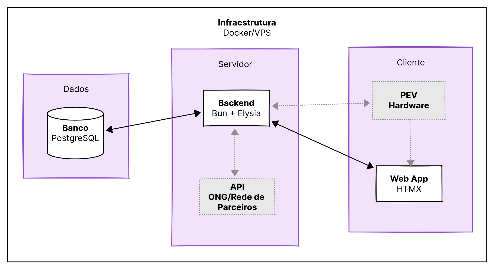

# Arquitetura do Sistema

Este documento centraliza a visão arquitetural do **EcoQuest (MVP)**, servindo como referência para decisões técnicas, diagramas e evolução do sistema.

## 1. Visão geral (MVP)

| Componente | Descrição | Tipo |
|------|----------------|--------------|
| Web App | Interface para usuários interagirem com o sistema. | Cliente |
| PEV Simulado | Simulação de integração com o hardware de coleta de resíduos potencialmente contaminantes. | Cliente |
| Servidor | Processamento de lógica de negócios, SSR e API. | Servidor |
| API de ONG/Rede de Parceiros Simulada | Simulação de integração com ONGs e parceiros para recompensas e precificação. | Servidor |
| Banco de Dados | Armazenamento de dados do sistema. | Dados |

## 2. Diagrama

Legenda:
- 

: Componentes em preto e branco são parte do MVP.
- 

: Componentes em cinza claro são simulações para fins de desenvolvimento e testes para o MVP na 1ª fase.
<!-- Aqui fazer uma seta com CSS e HTML -->
- Setas indicam fluxos de dados e interações entre os componentes:
	- 
↔
 : se bidirecionais, representam comunicação em ambos os sentidos;
	- 
→
 : se unidirecionais, representam comunicação em um sentido.
- 

 Blocos roxos são apenas para fins de visualização e não representam componentes reais do sistema.

## Histórico de Versão

| Data | Versão | Descrição da Alteração | Autor(a) |
|---|---:|---|---|
| 18/05/2026 | 1.0 | Criação da página de arquitetura e baseline do MVP. | João Victor |
