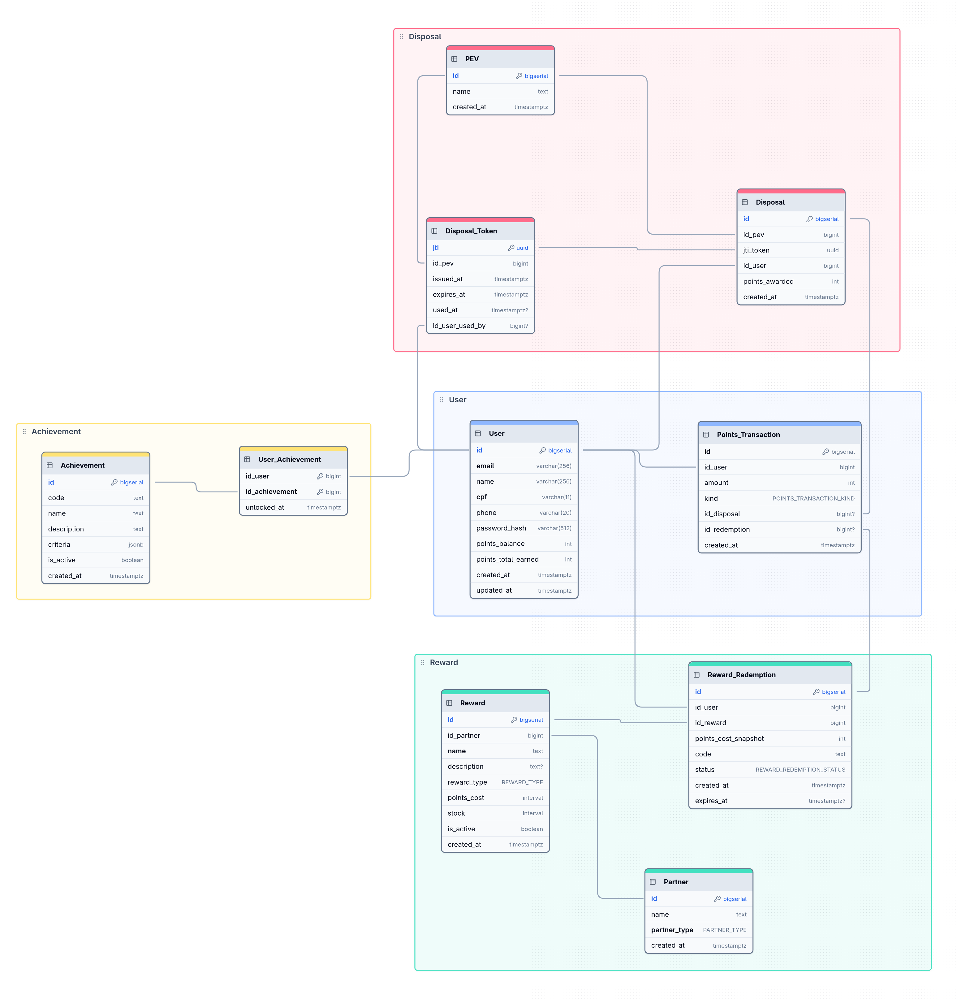

# Modelagem do Banco de Dados

Abaixo, segue a modelagem atual do banco de dados do projeto, representada por uma modelagem entidade-relacionamento (MER), evidenciando as principais entidades, atributos e relacionamentos necessários para suportar as funcionalidades do sistema.

