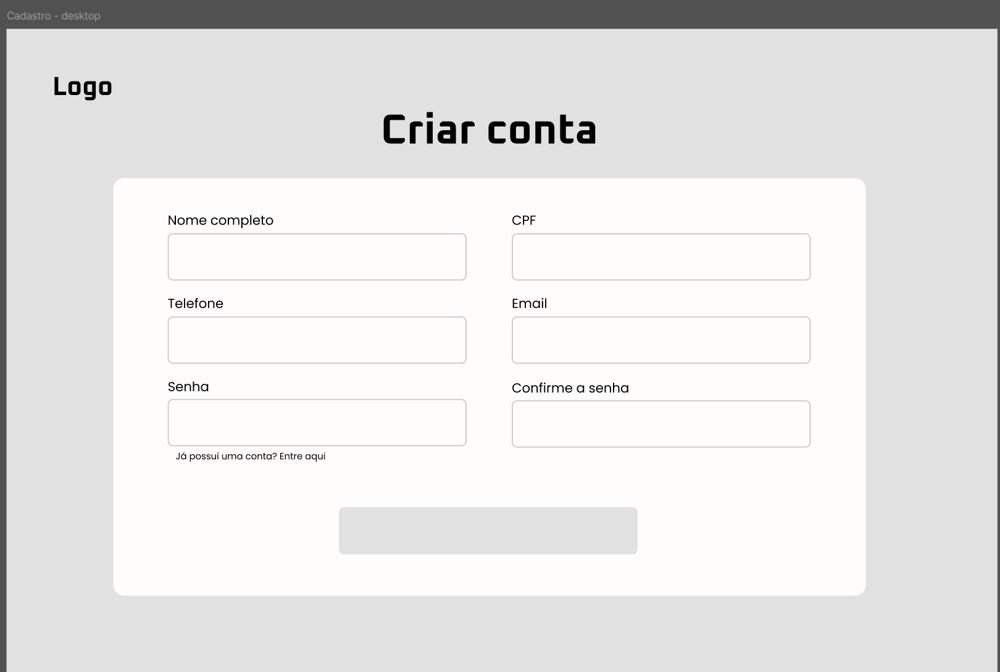
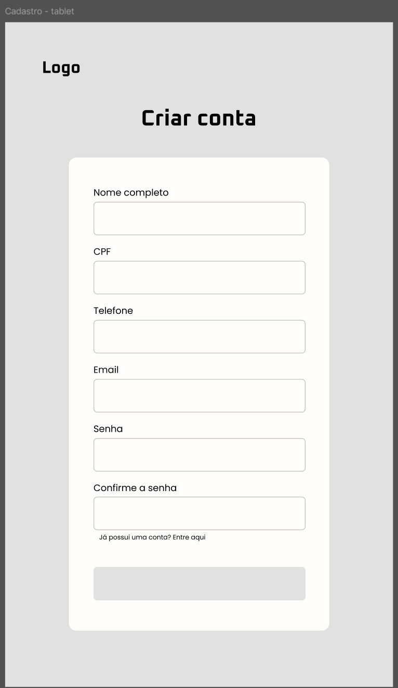
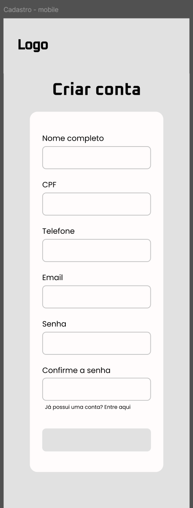
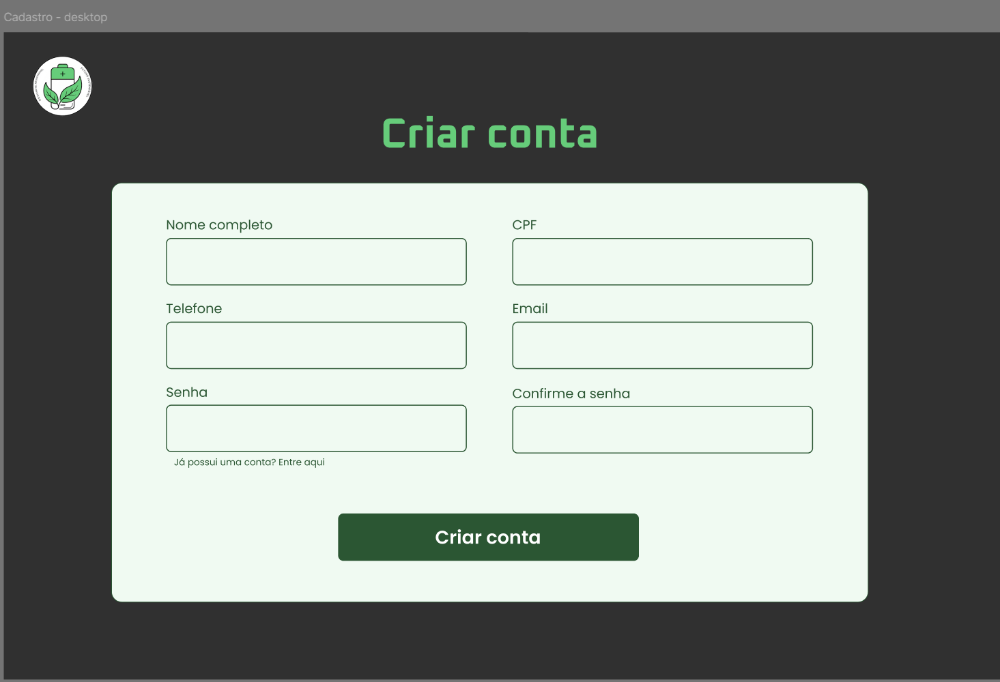
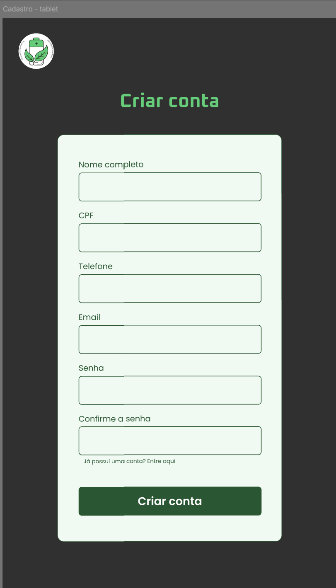
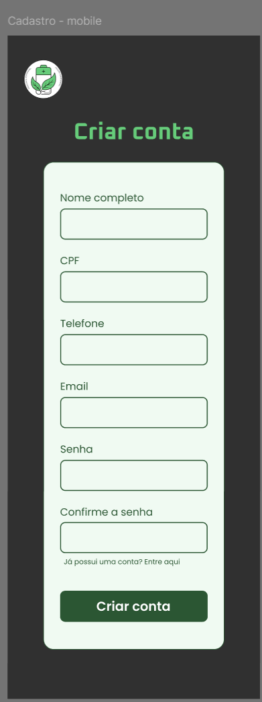

## UC01 — Cadastrar Usuário
 
**Atores:** Usuário

**Objetivo:** Permitir a criação de uma conta no sistema.

**Pré-condições:** Usuário não possuir cadastro ativo.

**Fluxo Principal**

1. Usuário acessa a tela de cadastro.
2. Usuário informa e-mail, senha e dados básicos.
3. Usuário aceita os termos de uso e a política de privacidade. (RN18) (FE-E4)
4. Sistema valida os dados informados, incluindo unicidade do e-mail (RN8) e política de senha (RN9) (FE-E2) (FE-E3).
5. Sistema cria a conta do usuário (FE-E1).
6. Sistema confirma o cadastro realizado.

**Fluxos Alternativos**

- Nenhum.

**Fluxos de Exceção**

- **FE-E1 — Falha ao salvar cadastro**

    - E1.1 Sistema tenta persistir os dados do usuário.
    - E1.2 Ocorre erro de comunicação com o banco de dados.
    - E1.3 Sistema cancela a operação.
    - E1.4 Sistema exibe mensagem informando que o cadastro não pôde ser concluído e para tentar novamente mais tarde.

- **FE-E2 — E-mail já cadastrado**

    - E2.1 Sistema identifica e-mail existente.
    - E2.2 Sistema exibe mensagem de erro.

- **FE-E3 — Dados inválidos**

    - E3.1 Sistema detecta campos inválidos ou vazios.
    - E3.2 Sistema solicita correção.

- **FE-E4 — Termos de uso não aceitos**

    - E4.1 Usuário não aceita os termos de uso ou a política de privacidade. (RN18)
    - E4.2 Sistema impede a continuidade do cadastro.

**Pós-condições:** Conta criada e ativa no sistema, com acesso liberado às funcionalidades desde o primeiro login.

[Link para o caso implementado](https://eco-quest.org/auth/cadastro)

### Protótipos

#### Baixa fidelidade (Wireframes)

#### Alta fidelidade (Mockups)

### Testes