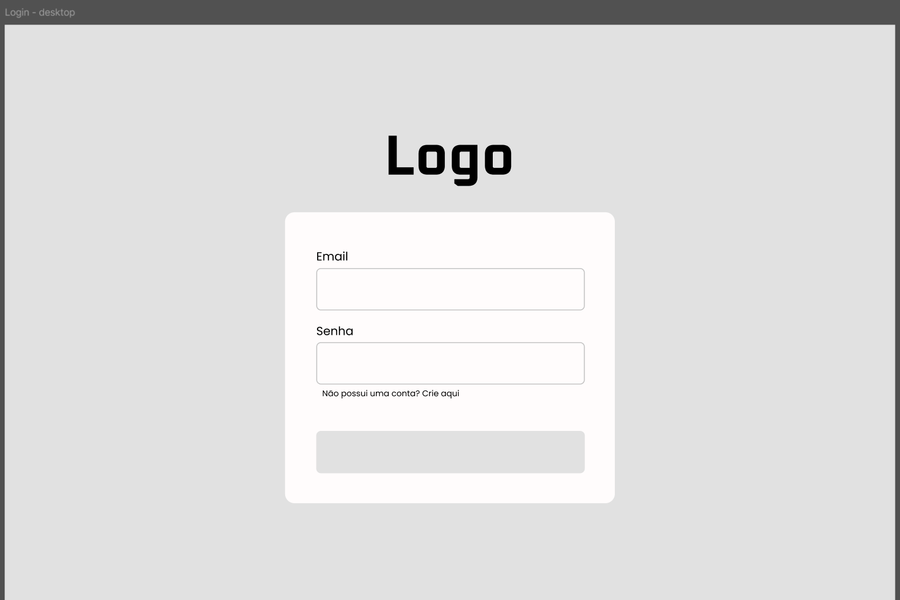
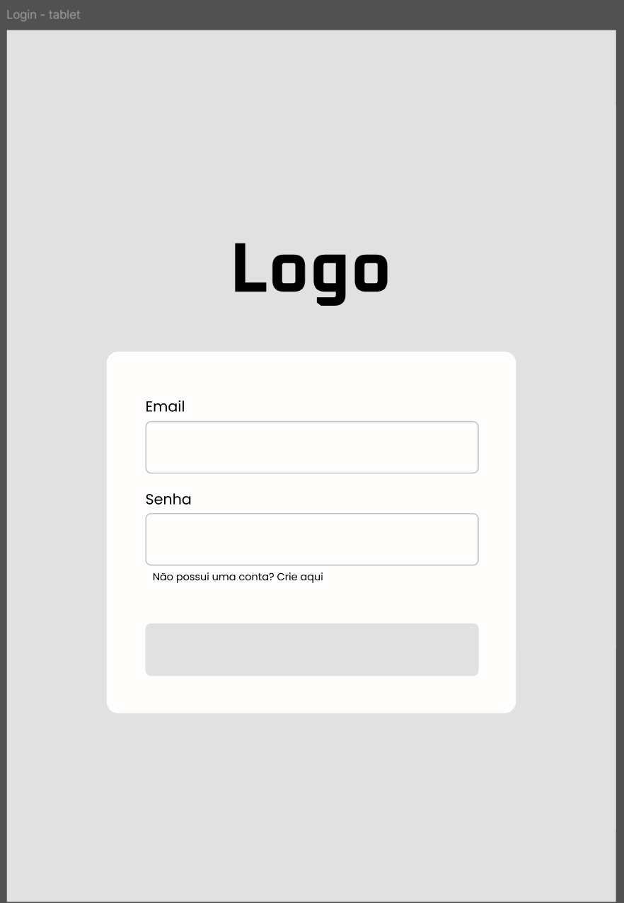
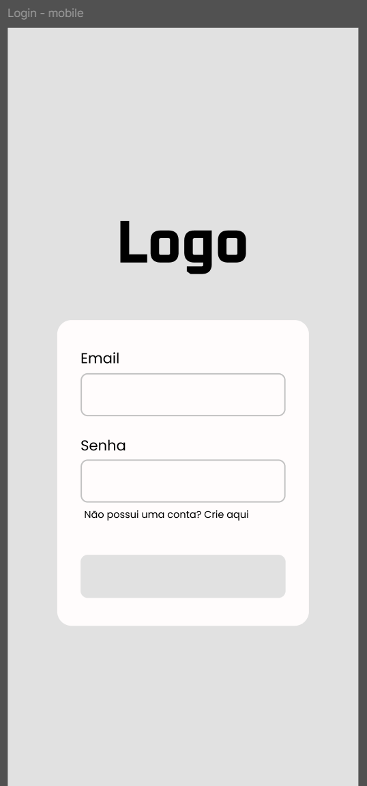
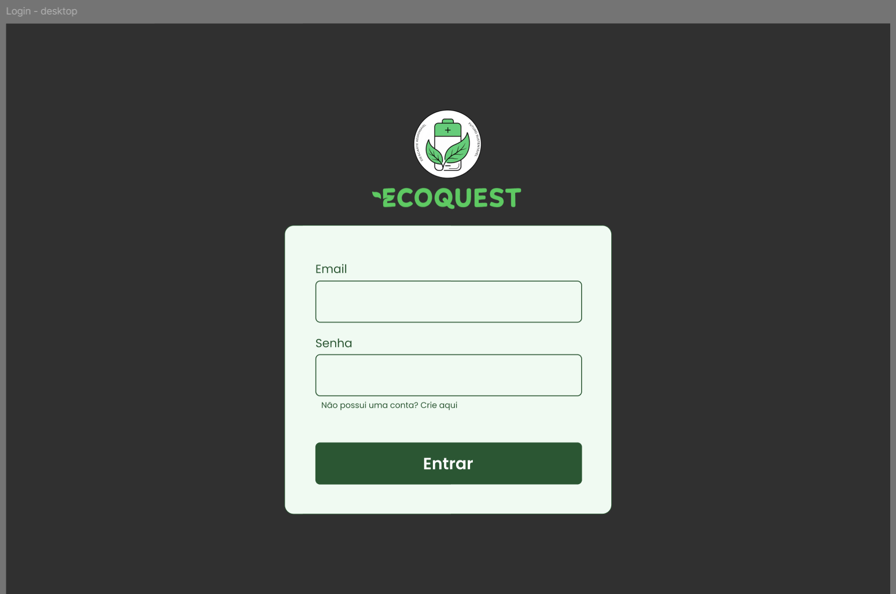
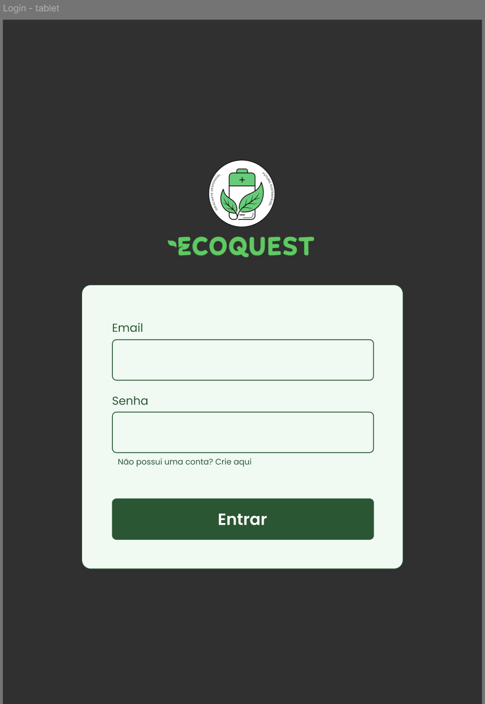
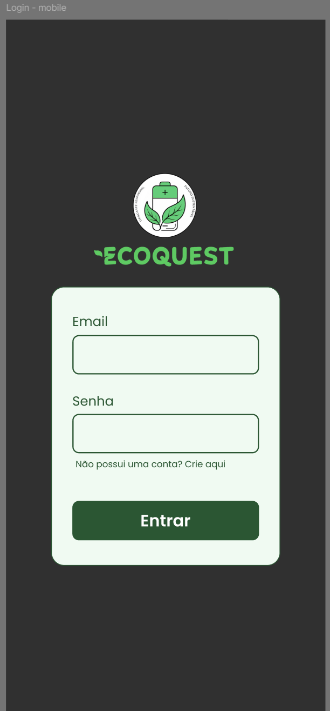

## UC02 — Autenticar Usuário
 
**Atores:** Usuário

**Objetivo:** Permitir acesso seguro ao sistema.

**Pré-condições:** Usuário possuir conta cadastrada.

**Fluxo Principal**

1. Usuário acessa a tela de login.
2. Usuário informa e-mail e senha.
3. Sistema valida as credenciais, verificando o número de tentativas consecutivas inválidas e o status da conta. (RN15) (FE-E1) (FE-E2) (FE-E3) (FE-E4)
4. Sistema inicia sessão autenticada, gerando token de acesso vinculado ao usuário.
5. Sistema libera acesso às funcionalidades.

**Fluxos Alternativos**

- Nenhum.

**Fluxos de Exceção**

- **FE-E1 — Serviço de autenticação indisponível**

    - E1.1 Sistema tenta validar as credenciais.
    - E1.2 O serviço de autenticação não responde.
    - E1.3 Sistema impede o acesso.
    - E1.4 Sistema informa indisponibilidade temporária e para tentar novamente mais tarde.

- **FE-E2 — Credenciais inválidas**

    - E2.1 Sistema rejeita autenticação.
    - E2.2 Sistema exibe mensagem de erro.

- **FE-E3 — Bloqueio por excesso de tentativas**

    - E3.1 Sistema identifica que o número de tentativas consecutivas com credenciais inválidas atingiu o limite definido. (RN15)
    - E3.2 Sistema bloqueia temporariamente novas tentativas de autenticação para a conta.
    - E3.3 Sistema informa o usuário sobre o bloqueio e orienta aguardar ou utilizar a recuperação de senha.

- **FE-E4 — Conta inativa ou bloqueada**

    - E4.1 Sistema identifica que a conta associada às credenciais está inativa, suspensa ou bloqueada por motivo administrativo.
    - E4.2 Sistema impede o início da sessão.
    - E4.3 Sistema informa o usuário sobre o status da conta e orienta o próximo passo, quando aplicável (ex.: contato com suporte).

**Pós-condições:**

- Sucesso: usuário autenticado, com sessão iniciada e acesso liberado às funcionalidades.
- Falha: usuário não autenticado, sessão não iniciada, acesso às funcionalidades não concedido.

[Link para o caso implementado](https://eco-quest.org/auth/login)

### Protótipos

#### Baixa fidelidade (Wireframes)

#### Alta fidelidade (Mockups)

### Testes