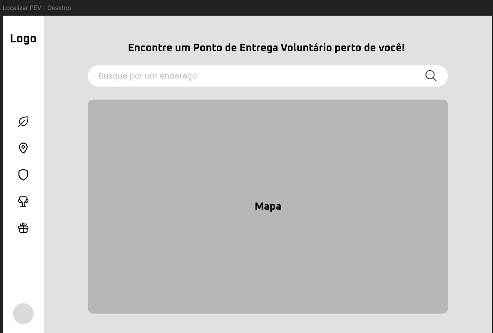
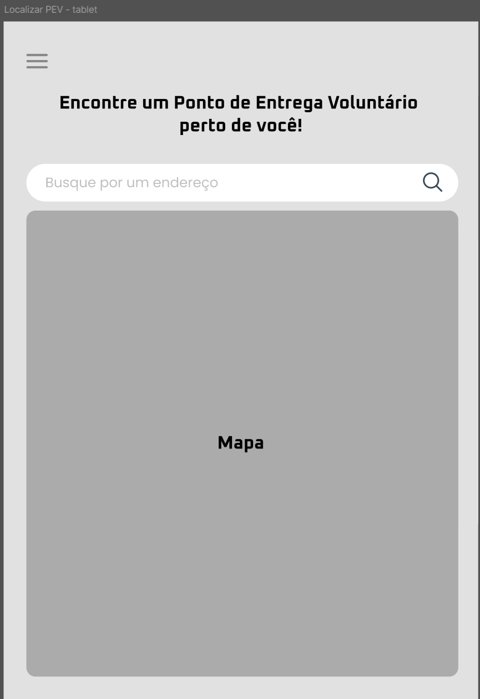
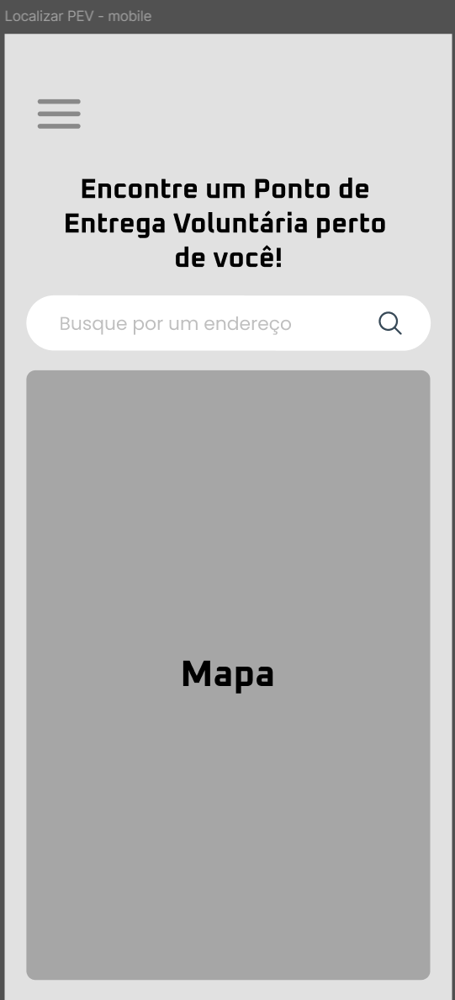
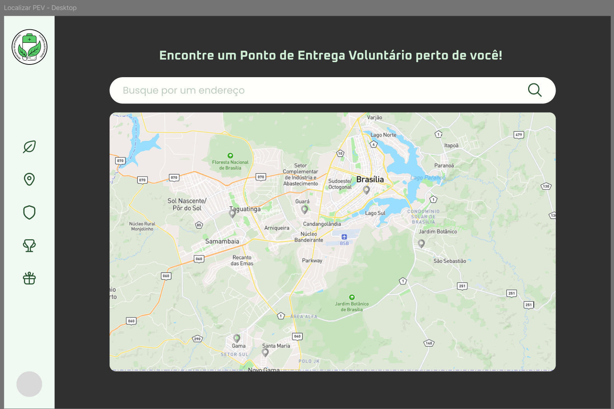
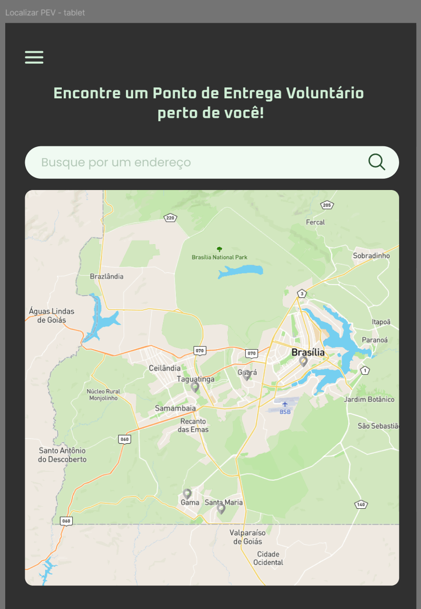
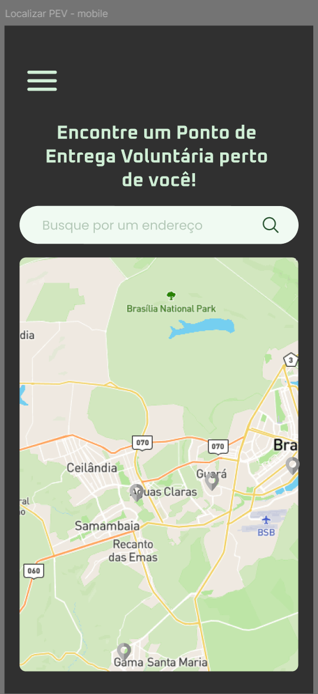

## UC06 — Localizar PEVs
 
**Atores:** Usuário

**Objetivo:** Exibir pontos de coleta próximos ao usuário.

**Pré-condições:** Nenhuma. A localização pode ser obtida automaticamente ou informada manualmente pelo usuário.

**Fluxo Principal**

1. Usuário acessa o mapa de PEVs.
2. Sistema obtém a geolocalização do usuário (FA-2A) (FE-E1).
3. Sistema busca os PEVs próximos, considerando apenas pontos ativos (RN11), dentro do raio de proximidade definido (RN12) (FA-3A).
4. Sistema exibe mapa interativo com os pontos disponíveis (FE-E2).
5. Usuário visualiza os PEVs disponíveis.

**Fluxos Alternativos**

- **FA-2A — Localização negada**

    - 2A.1 Usuário nega acesso à localização.
    - 2A.2 Sistema solicita localização manual.

- **FA-3A — Nenhum PEV encontrado**

    - 3A.1 Sistema não encontra pontos próximos.
    - 3A.2 Sistema informa indisponibilidade.

**Fluxos de Exceção**

- **FE-E1 — Falha no serviço de geolocalização**

    - E1.1 Sistema não obtém a localização automaticamente.
    - E1.2 Sistema oferece busca manual por endereço ou região.

- **FE-E2 — Falha ao carregar mapa ou lista de PEVs**

    - E2.1 Sistema informa indisponibilidade temporária.
    - E2.2 Sistema permite nova tentativa de carregamento.

**Pós-condições:** Lista ou mapa de PEVs exibido ao usuário.

[Link para o caso implementado](https://eco-quest.org/localizar-pev)

### Protótipos

#### Baixa fidelidade (Wireframes)

#### Alta fidelidade (Mockups)

### Testes