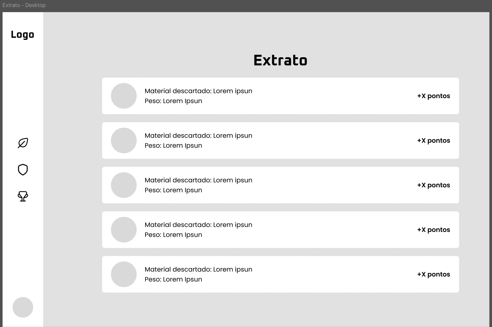
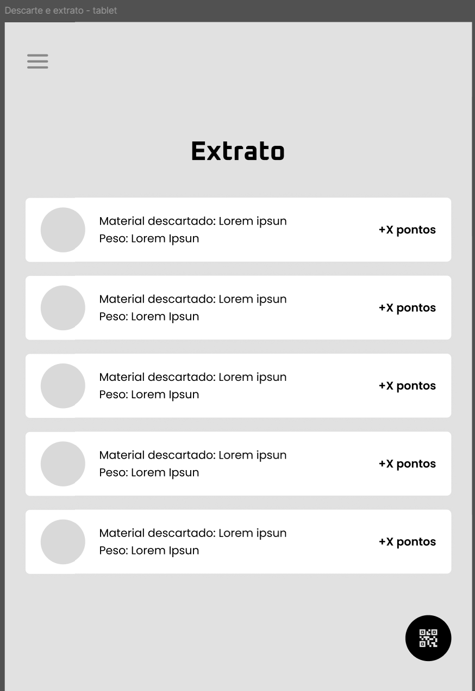
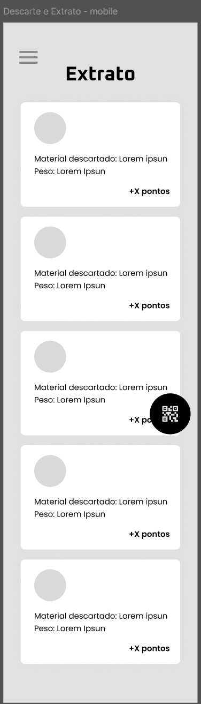
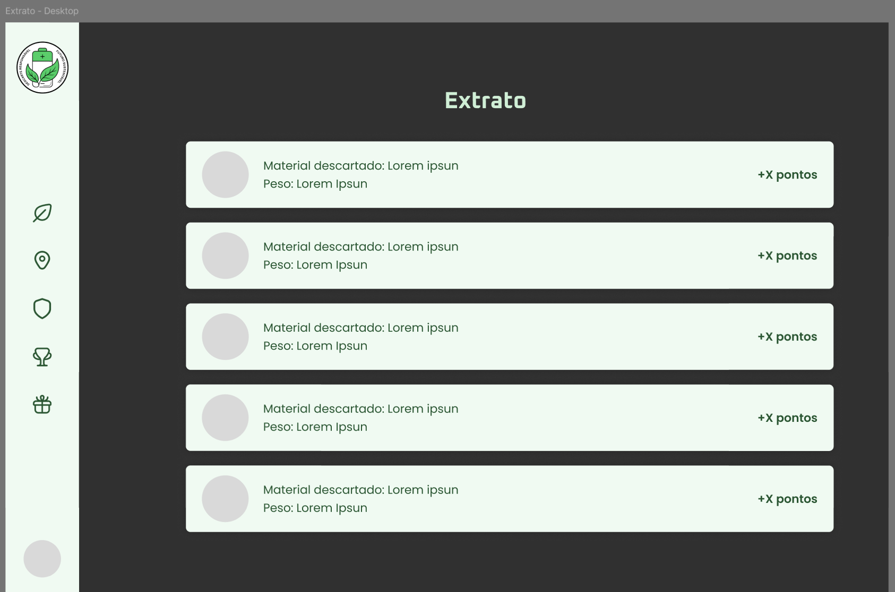
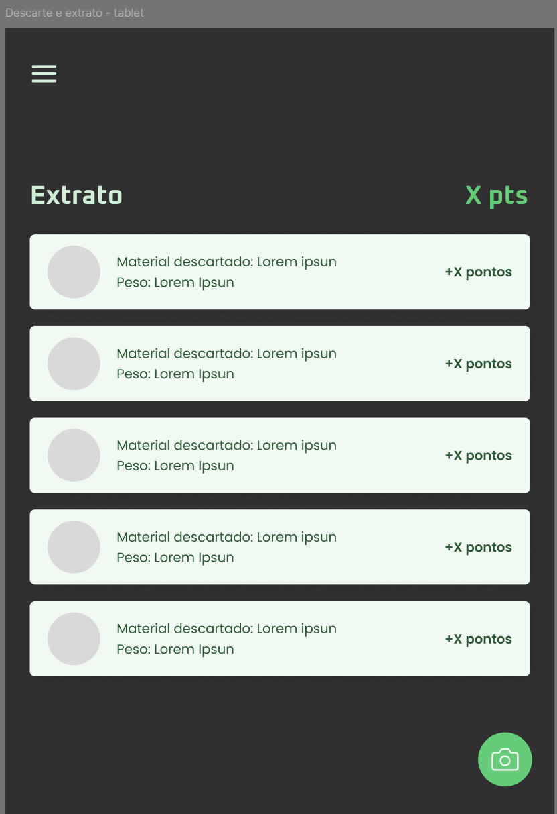
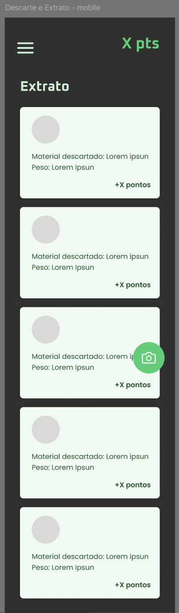
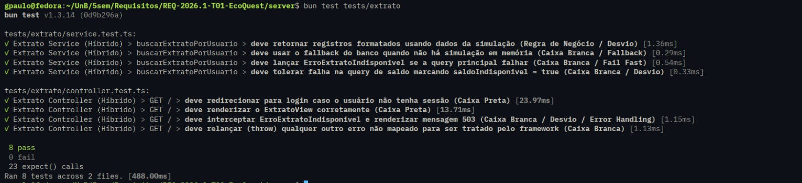

## UC09 — Consultar Extrato
 
**Atores:** Usuário

**Objetivo:** Exibir histórico de descartes e saldo de créditos disponível.

**Pré-condições:** Usuário autenticado.

**Fluxo Principal**

1. Usuário acessa a área de extrato.
2. Sistema recupera o histórico de descartes do usuário (FA-2A) (FE-E1).
3. Sistema exibe lista de operações realizadas, contendo data, PEV de origem, tipo de resíduo, volume/peso e pontos obtidos em cada descarte.
4. Sistema exibe saldo de créditos disponível, calculado a partir das pontuações obtidas pelos descartes realizados. (RN3) (FE-E2)
5. Usuário consulta as informações.

**Fluxos Alternativos**

- **FA-2A — Sem histórico**

    - 2A.1 Sistema não encontra registros.
    - 2A.2 Sistema informa ausência de histórico.

**Fluxos de Exceção**

- **FE-E1 — Falha ao carregar histórico de descartes e pontos**

    - E1.1 Sistema não exibe saldo ou movimentações incompletas como definitivas.
    - E1.2 Sistema informa indisponibilidade temporária do extrato.

- **FE-E2 — Falha ao calcular saldo atualizado**

    - E2.1 Sistema mantém o último saldo confiável.
    - E2.2 Sistema informa que a atualização do saldo não foi concluída.

**Pós-condições:**

- Extrato exibido ao usuário com histórico de descartes e saldo de pontos.
- Quando não houver histórico, extrato vazio é exibido com saldo zerado.

[Link para o caso implementado](https://eco-quest.org)

### Protótipos

#### Baixa fidelidade (Wireframes)

#### Alta fidelidade (Mockups)

### Testes

