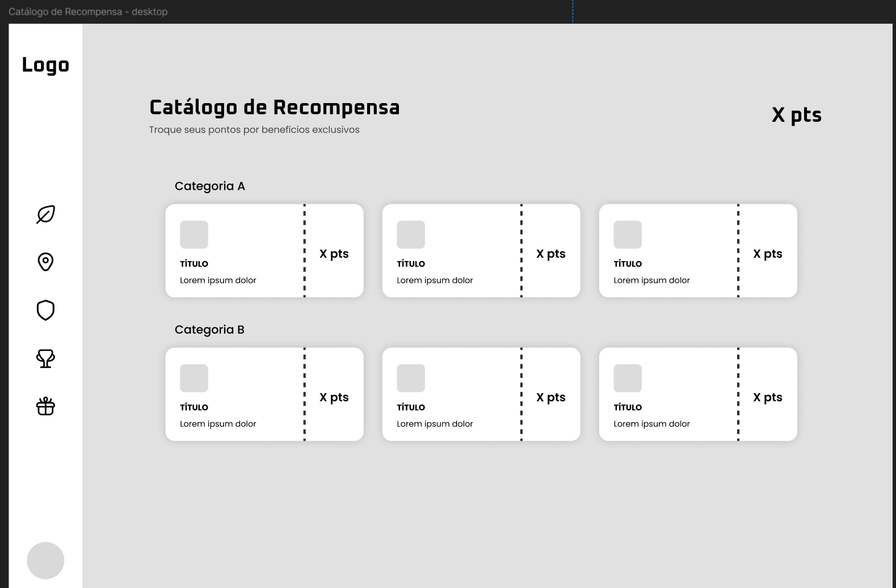
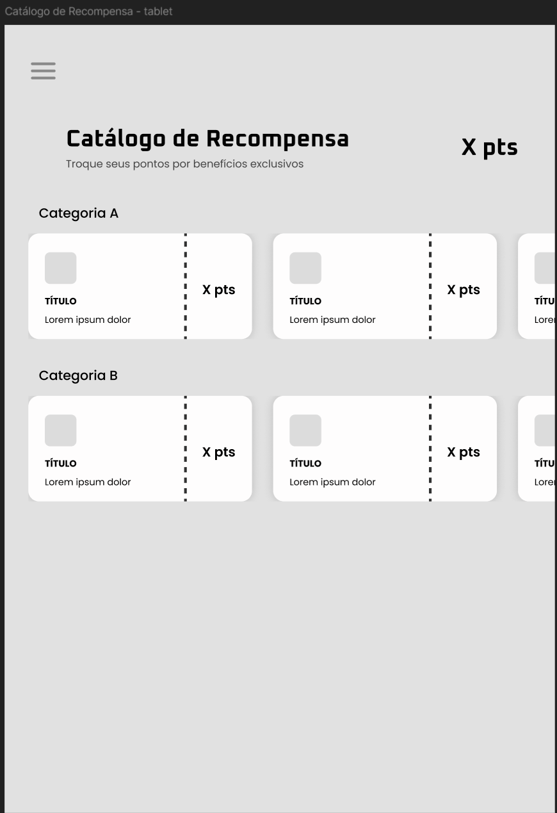
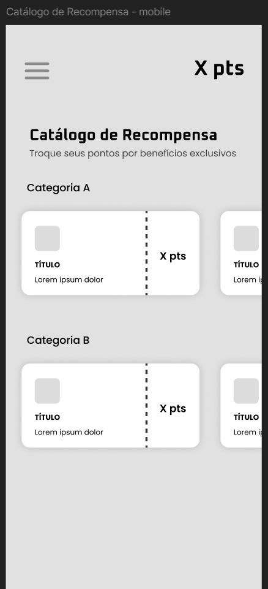
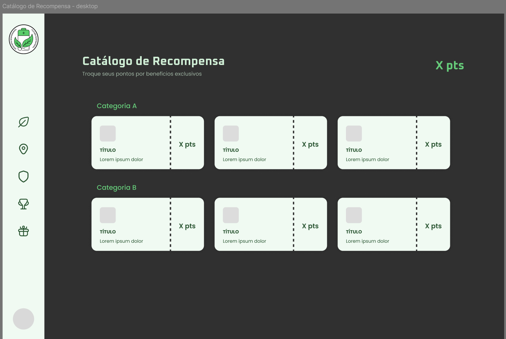
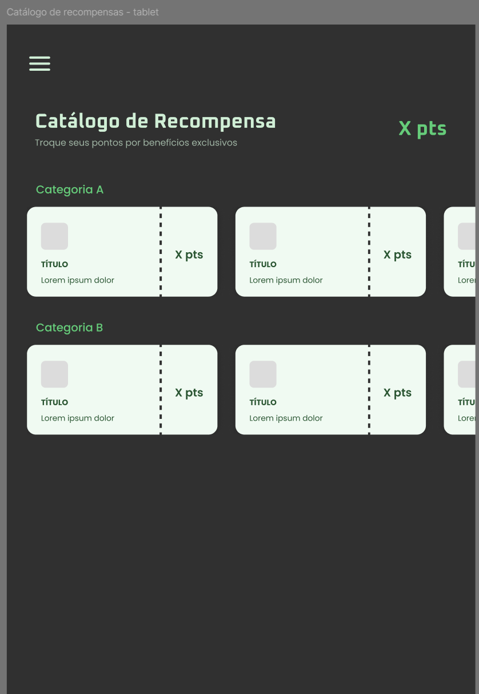
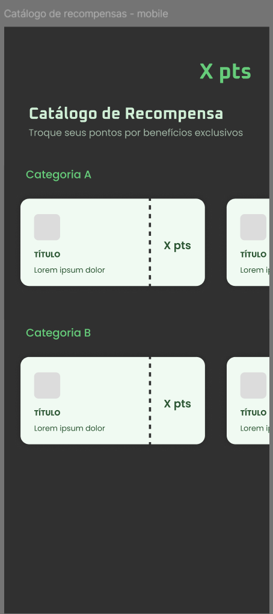

## UC10 — Exibir Catálogo de Recompensas
 
**Atores:** Usuário

**Objetivo:** Exibir benefícios, cupons e prêmios disponíveis para resgate.

**Pré-condições:** Usuário autenticado.

**Fluxo Principal**

1. Usuário acessa o catálogo de recompensas.
2. Sistema recupera os itens disponíveis e seus respectivos custos em pontos configurados pelos administradores do sistema, considerando apenas recompensas ativas e em estoque. (RN1) (RN13) (FE-E1)
3. Sistema consulta o saldo de pontos do usuário. (FE-E2)
4. Sistema exibe catálogo com benefícios, cupons e prêmios, indicando quais recompensas o usuário pode resgatar com o saldo atual. (RN5) (FA-4A)
5. Usuário visualiza as recompensas disponíveis.

**Fluxos Alternativos**

- **FA-4A — Sem itens disponíveis**

    - 4A.1 Sistema não encontra recompensas cadastradas.
    - 4A.2 Sistema informa ausência de itens.

**Fluxos de Exceção**

- **FE-E1 — Falha ao carregar catálogo**

    - E1.1 Sistema não exibe lista parcial como catálogo completo.
    - E1.2 Sistema informa indisponibilidade temporária dos itens.

- **FE-E2 — Falha ao consultar saldo do usuário**

    - E2.1 Sistema exibe o catálogo sem habilitar a indicação de itens resgatáveis.
    - E2.2 Sistema informa que a disponibilidade por pontos não pôde ser verificada no momento.

**Pós-condições:** Catálogo exibido ao usuário, com indicação de custo em pontos e de quais recompensas são resgatáveis com o saldo atual.

[Link para o caso implementado](https://eco-quest.org/recompensas)

### Protótipos

#### Baixa fidelidade (Wireframes)

#### Alta fidelidade (Mockups)

### Testes