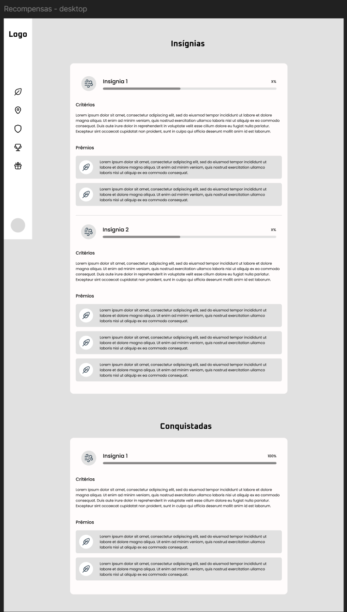
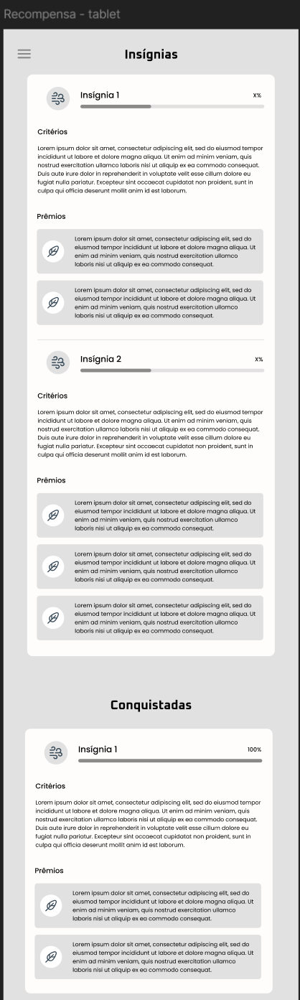
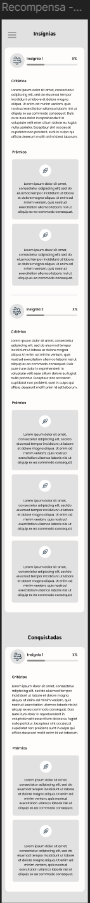
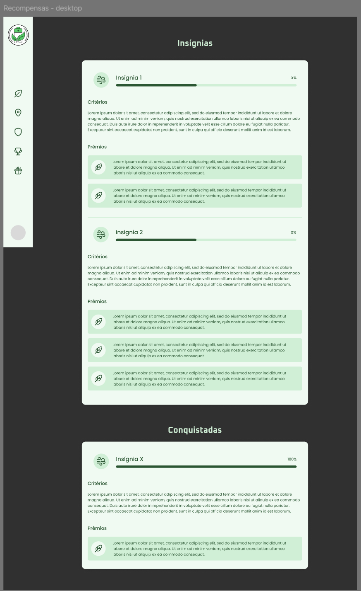
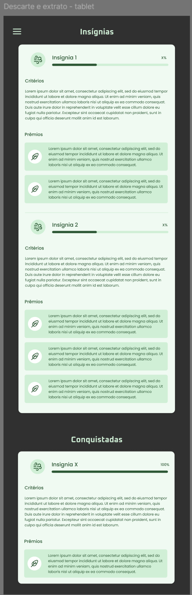
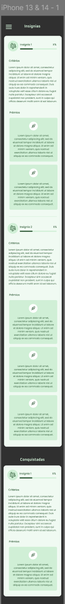
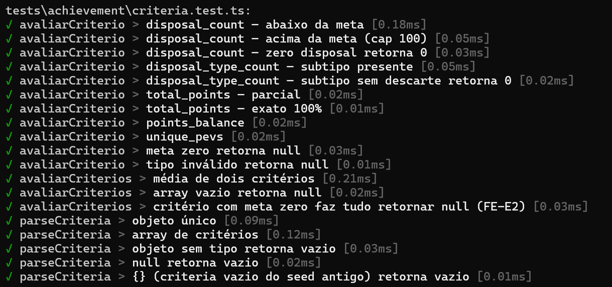

## UC12 — Exibir Vitrine de Conquistas
 
**Atores:** Usuário

**Objetivo:** Exibir marcos e medalhas conquistados pelo usuário, incluindo conquistas ainda não desbloqueadas e o progresso do usuário em relação a elas.

**Pré-condições:** Usuário autenticado.

**Fluxo Principal**

1. Usuário acessa a vitrine de conquistas.
2. Sistema recupera as conquistas obtidas automaticamente a partir dos critérios definidos para cada insígnia, com base no histórico de descartes do usuário (UC08). (RN4) (FA-2A) (FE-E1)
3. Sistema exibe medalhas e marcos obtidos.
4. Sistema exibe conquistas ainda não desbloqueadas, com o percentual de progresso de cada uma. (RN4) (RN7) (FE-E2)
5. Usuário visualiza seu progresso.

**Fluxos Alternativos**

- **FA-2A — Sem conquistas**

    - 2A.1 Sistema não encontra conquistas obtidas registradas.
    - 2A.2 Sistema exibe vitrine vazia, com todas as conquistas disponíveis exibidas como bloqueadas e progresso inicial (0%).

**Fluxos de Exceção**

- **FE-E1 — Falha ao carregar conquistas**

    - E1.1 Sistema não exibe progresso incompleto como definitivo.
    - E1.2 Sistema informa indisponibilidade temporária da vitrine.

- **FE-E2 — Falha ao calcular progresso das conquistas bloqueadas**

    - E2.1 Sistema exibe somente informações confiáveis. (RN7)
    - E2.2 Sistema informa que parte do progresso não pôde ser calculada.
        
**Pós-condições:**

- Vitrine exibida com conquistas obtidas, conquistas bloqueadas e o percentual de progresso de cada uma.

[Link para o caso implementado](https://eco-quest.org/insignias)

### Protótipos

#### Baixa fidelidade (Wireframes)

#### Alta fidelidade (Mockups)

### Testes

