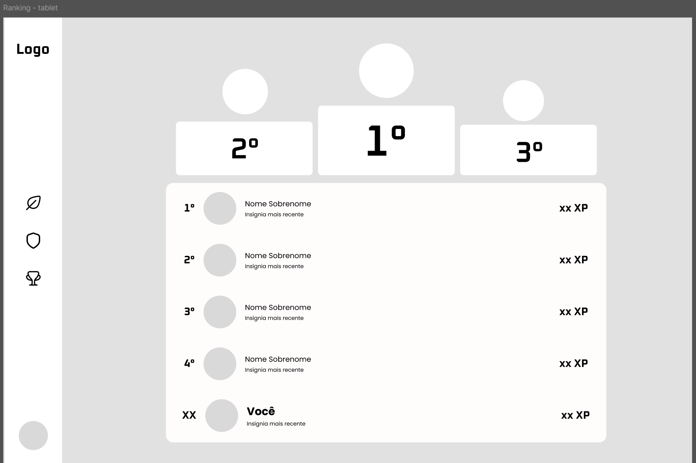
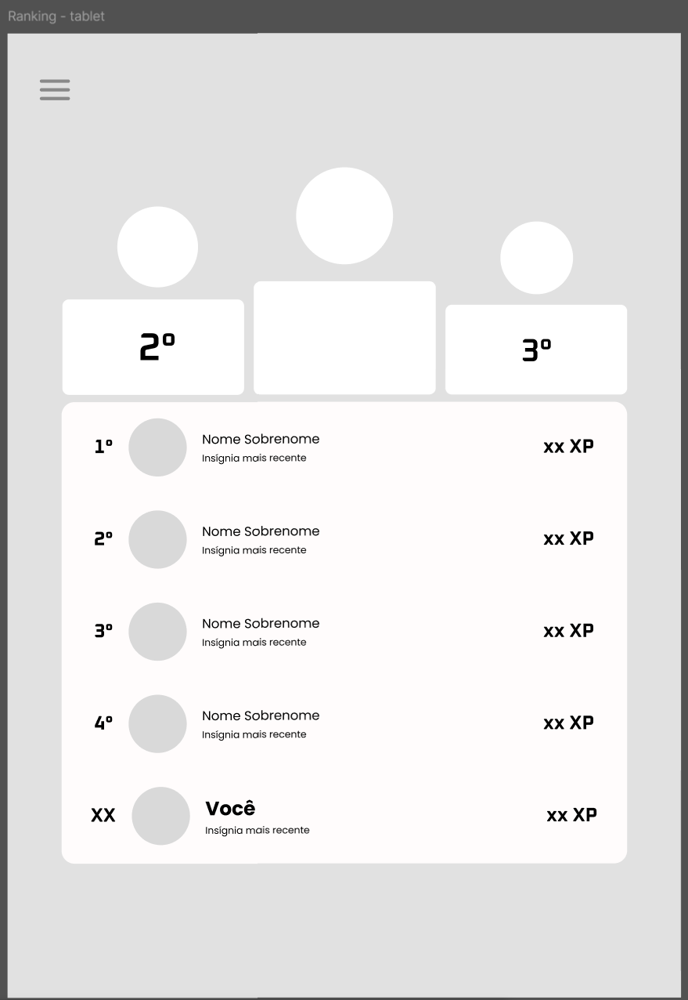
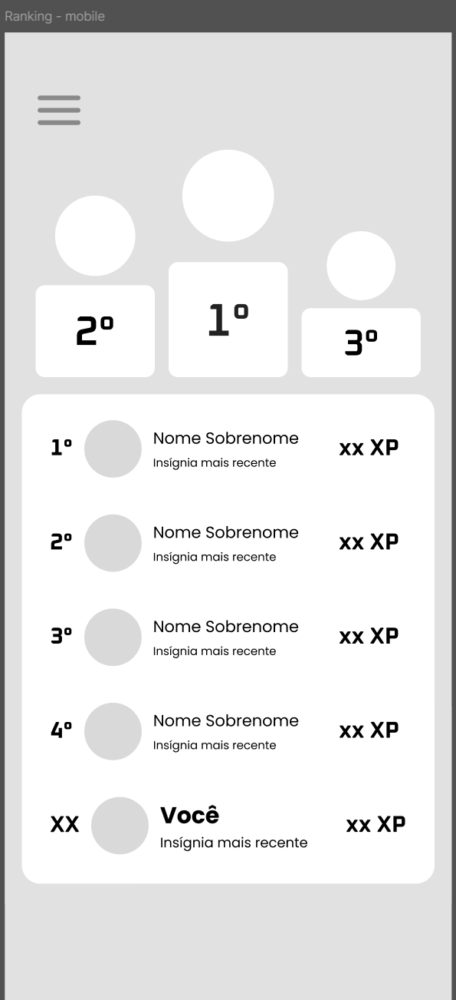
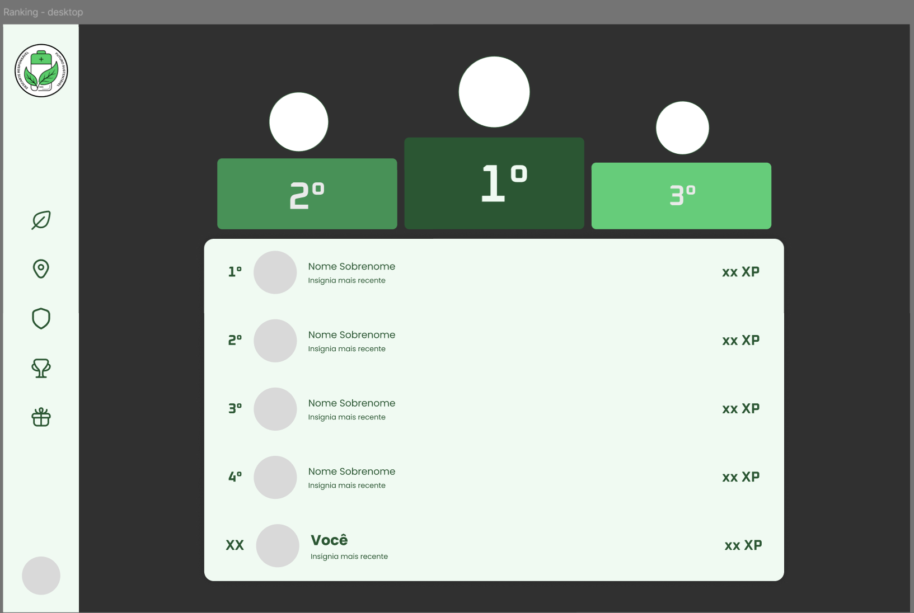
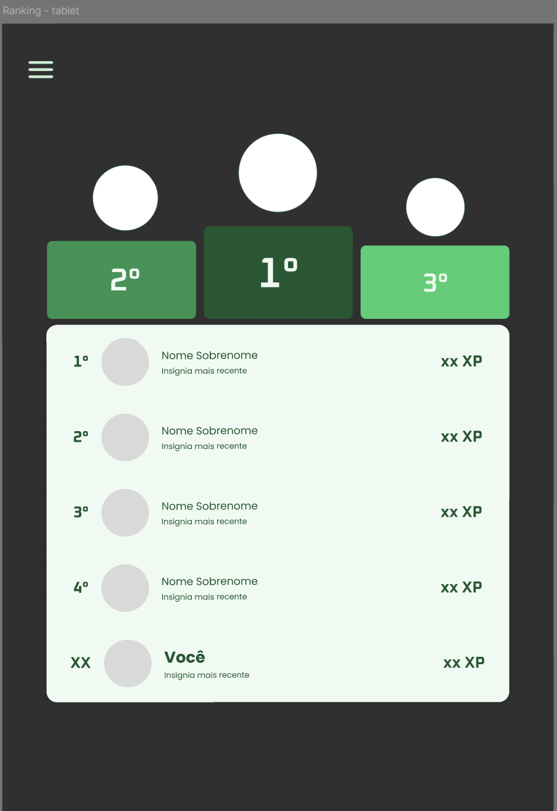
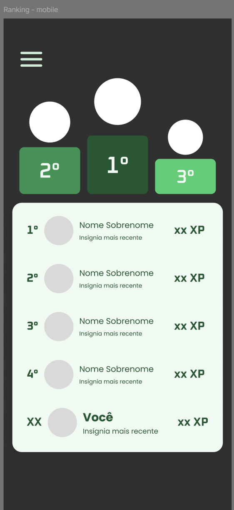

## UC15 — Visualizar Ranking
 
**Atores:** Usuário

**Objetivo:** Exibir o ranking social (Top N) com a pontuação dos usuários mais bem classificados.

**Pré-condições:** Usuário autenticado.

**Fluxo Principal**

1. Usuário acessa o ranking.
2. Sistema recupera a classificação dos N usuários com maior pontuação, com base na pontuação acumulada pelos descartes realizados. (RN3) (FA-2A) (FE-E1) (FE-E3)
3. Sistema exibe lista ordenada por pontuação, respeitando as preferências de anonimato configuradas pelos usuários. (RN14) (FE-E2)
4. Sistema destaca a posição do usuário no ranking, caso ele esteja entre os N primeiros colocados. (FA-4A)
5. Usuário visualiza o ranking.

**Fluxos Alternativos**

- **FA-2A — Ranking vazio**

    - 2A.1 Sistema não encontra usuários com pontuação registrada para compor a classificação.
    - 2A.2 Sistema exibe ranking vazio, informando ausência de dados.

**Fluxos de Exceção**

- **FE-E1 — Falha ao carregar ranking**

    - E1.1 Sistema não exibe classificação incompleta como definitiva.
    - E1.2 Sistema informa indisponibilidade temporária do ranking.

- **FE-E2 — Falha ao aplicar preferências de anonimato**

    - E2.1 Sistema preserva a privacidade configurada pelos usuários, impedindo a exibição do ranking até a aplicação correta das preferências.
    - E2.2 Sistema informa que o ranking não pôde ser exibido no momento.

- **FE-E3 — Ranking indisponível**

    - E3.1 Sistema não consegue carregar os dados.
    - E3.2 Sistema informa indisponibilidade temporária.
        
**Pós-condições:**

- Ranking Top N exibido ao usuário, com anonimato aplicado conforme preferências configuradas.
- Quando o usuário não estiver entre os N primeiros, sua posição é informada separadamente da listagem.

### Protótipos

#### Baixa fidelidade (Wireframes)

#### Alta fidelidade (Mockups)

### Testes