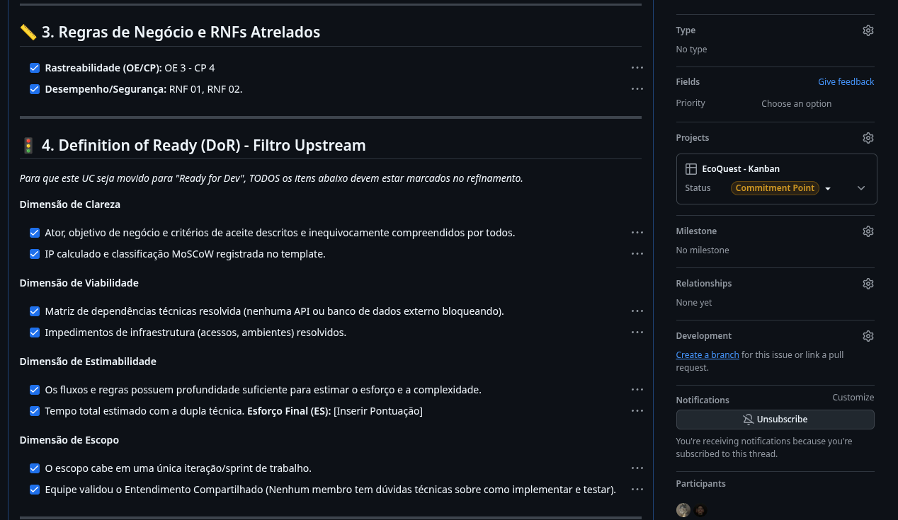
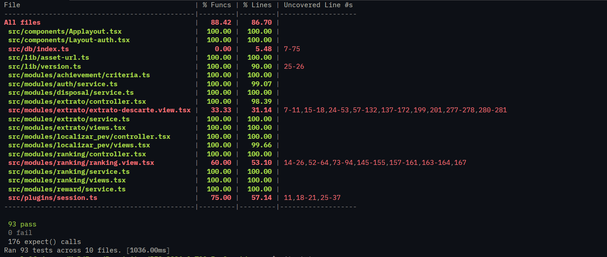

# Planejamento e Organização

## Rastreabilidade Casos de Uso (Miro)

<iframe width="768" height="640" src="https://miro.com/app/live-embed/uXjVHD1J5kw=/?focusWidget=3458764676704818502&embedMode=view_only_without_ui&embedId=312956549520" frameborder="0" scrolling="no" allow="fullscreen; clipboard-read; clipboard-write" allowfullscreen></iframe>

<iframe width="768" height="640" src="https://miro.com/app/live-embed/uXjVHD1J5kw=/?focusWidget=3458764676705338553&embedMode=view_only_without_ui&embedId=261349376383" frameborder="0" scrolling="no" allow="fullscreen; clipboard-read; clipboard-write" allowfullscreen></iframe>

<iframe width="768" height="640" src="https://miro.com/app/live-embed/uXjVHD1J5kw=/?focusWidget=3458764676706053993&embedMode=view_only_without_ui&embedId=665819070425" frameborder="0" scrolling="no" allow="fullscreen; clipboard-read; clipboard-write" allowfullscreen></iframe>

## Planejamento

### 1. Fase de Concepção
**Período:** 13 de Abril – 18 de Maio (Iterações 1 a 5)  
**Foco Estratégico:** Entendimento do domínio, definição do problema e viabilidade de negócio.

#### Gatilho de Entrada
* Problema de negócio identificado e engajamento inicial da cliente.

#### Artefatos de Saída e Auditoria da Fase
* [Documento de Visão aprovado e rastreável](../cenario-atual-do-cliente-e-do-negocio/README.md)
* [Objetivos Específicos (OEs) e Características de Produto (CPs) documentados](../solucao-proposta/README.md)
* [Lista de Itens de Trabalho Geral inicial estabelecida (MoSCoW)](../lista-de-itens-de-trabalho/README.md)

  
Visualizar Quadro Miro da Concepção

   
  <iframe width="100%" height="600" src="https://miro.com/app/live-embed/uXjVHD1J5kw=/?focusWidget=3458764676704818502&embedMode=view_only_without_ui&embedId=312956549520" frameborder="0" scrolling="no" allow="fullscreen; clipboard-read; clipboard-write" allowfullscreen></iframe>

> **Registro Histórico de Mudança de Escopo:** O escopo inicial sofreu grande pivotagem, exigindo a extensão desta fase. A formalização desta alteração de direcionamento está baseada nos critérios explicitados no cenário atual do negócio do cliente.

**Marco de Transição:** Deadline da Unidade 2 alcançado, escopo estabilizado e critérios de trabalho definidos.

---

### 2. Fase de Elaboração
**Período:** 19 de Maio - 30 de Maio (Iterações 6 e 7)  
**Foco Estratégico:** Estabilização da arquitetura, modelagem da interface e validação rigorosa das políticas de qualidade (Definition of Ready e Definition of Done).

#### Gatilho de Entrada
* Marco da Concepção validado.

#### Artefatos de Saída e Auditoria da Fase
* [Arquitetura técnica estável e integrada ao pipeline](../evidencias/arquitetura-do-sistema/README.md)

  
Ver Diagrama de Arquitetura

  

* [Casos de Uso prioritários detalhados](../lista-de-itens-de-trabalho/README.md)

  
Visualizar Quadro Miro de Casos de Uso

   
  <iframe width="100%" height="600" src="https://miro.com/app/live-embed/uXjVHSUAvQU=/?embedMode=view_only_without_ui&moveToViewport=34%2C-457%2C660%2C624&embedId=629367810078" frameborder="0" scrolling="no" allowfullscreen></iframe>

* Protótipos visuais de interface aprovados.

  
Visualizar Protótipos (Figma)

   
  <iframe style="border: 1px solid rgba(0, 0, 0, 0.1);" width="100%" height="450" src="https://embed.figma.com/design/MFLYnCDDLU5OW4nXwLvjpd/EcoQuest--Unidade-4-?node-id=288-523&embed-host=share" allowfullscreen></iframe>

#### Comprovação de Aplicação de DoR e DoD
O uso efetivo do DoR e DoD foi registrado nas respectivas issues dos casos de uso. Os critérios e evidências de DoR foram validados em cada uma das issues dos casos de uso priorizados antes da aprovação para o desenvolvimento.

**Evidência de DoR:** Links para os checklists de DoR aplicados nas issues dos casos de uso.

  
Ver Exemplo de Evidência DoR

  

* **Links das Issues auditadas:**
  [UC-1](https://github.com/mdsreq-fga-unb/REQ-2026.1-T01-EcoQuest/issues/74) | [UC-2](https://github.com/mdsreq-fga-unb/REQ-2026.1-T01-EcoQuest/issues/) | [UC-6 ](https://github.com/mdsreq-fga-unb/REQ-2026.1-T01-EcoQuest/issues/47) | [UC-8](https://github.com/mdsreq-fga-unb/REQ-2026.1-T01-EcoQuest/issues/) | [UC-9](https://github.com/mdsreq-fga-unb/REQ-2026.1-T01-EcoQuest/issues/) | [UC-10 ](https://github.com/mdsreq-fga-unb/REQ-2026.1-T01-EcoQuest/issues/48) | [UC-11](https://github.com/mdsreq-fga-unb/REQ-2026.1-T01-EcoQuest/issues/49) | [UC-12](https://github.com/mdsreq-fga-unb/REQ-2026.1-T01-EcoQuest/issues/50) | [UC-15](https://github.com/mdsreq-fga-unb/REQ-2026.1-T01-EcoQuest/issues/51)

**Marco de Transição:** *Marco de Arquitetura do Ciclo de Vida* — A fundação técnica demonstrou suportar a escala de construção e o fluxo de trabalho foi validado na prática.

---

### 3. Fase de Construção
**Período:** 01 de Junho - 29 de Junho (Iterações 8 a 11)  
**Foco Estratégico:** Desenvolvimento em fluxo contínuo, garantindo qualidade técnica por meio de Code Review e validação incremental.

#### Gatilho de Entrada
* Arquitetura validada e itens de backlog cumprindo o Definition of Ready (DoR).

#### Artefatos de Saída e Auditoria da Fase
* **Comprovação de DoD de Negócio (Nível 2):** 100% dos Casos de Uso compromissados para o MVP foram validados contra o nosso Definition of Done. A aplicação prática do DoD ocorreu no processo de revisão de código, onde os critérios (passar em testes, linting, aprovação de pares) foram exigidos antes do merge.
* **Evidência de DoD:** Todas as Issues dos casos de uso do MVP passaram por ambas as etapas de DoR e DoD de forma rastreável, como exemplificado abaixo:
  * **[UC-6 (#47)](https://github.com/mdsreq-fga-unb/REQ-2026.1-T01-EcoQuest/issues/47)**
  * **[UC-15 (#51)](https://github.com/mdsreq-fga-unb/REQ-2026.1-T01-EcoQuest/issues/51)**

  
Ver Comprovação UC-15

  

* **Qualidade e Testes:** A taxa de cobertura de testes unitários foi monitorada rigorosamente para o cumprimento da restrição arquitetural mínima de 70%.

  
Ver Cobertura de Testes

  

> **Auditoria de Release:** O site da aplicação encontra-se publicado e funcional no domínio: **[EcoQuest](https://eco-quest.org)**

**Marco de Transição:** O software é capaz de executar seus fluxos críticos em ambiente produtivo, validado com sucesso pelos stakeholders.

---

### 4. Fase de Transição
**Período:** 30 de Junho - 5 de Julho (Iteração 12)  
**Foco Estratégico:** Homologação em campo, polimento final, correção de anomalias e entrega de valor.

#### Gatilho de Entrada
* *Release Candidate* operando sem bugs críticos impeditivos.

#### Artefatos de Saída e Auditoria da Fase
* Termo de aceite/homologação final validado com a cliente.
* Sistema 100% funcional em deploy.
* Documentação técnica final e Matriz de Rastreabilidade atualizadas.

**Marco de Transição:** *Marco de Liberação do Produto* — Encerramento técnico da versão atual do MVP do projeto.

## Quadro MVP

| ID       | Nome | Status | PR | Commit | Validação |
| -------- | ----------- | ----------------- | --- | ------ | --------- |
| [**UC01**](https://mdsreq-fga-unb.github.io/REQ-2026.1-T01-EcoQuest/#/lista-de-itens-de-trabalho/uc01) | Cadastrar usuário  | CONCLUÍDO | [PR #39](https://github.com/mdsreq-fga-unb/REQ-2026.1-T01-EcoQuest/pull/39) | [Commit 4e0065c](https://github.com/mdsreq-fga-unb/REQ-2026.1-T01-EcoQuest/commit/4e0065c4d0ea6ca59a7b855393e849eb61bd1661) [Commit 4f35be5](https://github.com/mdsreq-fga-unb/REQ-2026.1-T01-EcoQuest/commit/4f35be5ca2fc5f5946be7033c930462c379183e5) [Commit 0d1e6dd2](https://github.com/mdsreq-fga-unb/REQ-2026.1-T01-EcoQuest/commit/0d1e6dd24d3d9038a88762b8b0df350fab935110) [Commit 8e2d9ba9](https://github.com/mdsreq-fga-unb/REQ-2026.1-T01-EcoQuest/commit/8e2d9ba9cee29ae7c0bfd8d9fcd1d684ac9f5c32) [Commit d74433c](https://github.com/mdsreq-fga-unb/REQ-2026.1-T01-EcoQuest/commit/d74433c94d15e7d952e60bbd87017c86a4246957) | [Ata 30/06](https://mdsreq-fga-unb.github.io/REQ-2026.1-T01-EcoQuest/#/atas/30-06) |
| [**UC02**](https://mdsreq-fga-unb.github.io/REQ-2026.1-T01-EcoQuest/#/lista-de-itens-de-trabalho/uc02) | Autenticar usuário   | CONCLUÍDO |  [PR #39](https://github.com/mdsreq-fga-unb/REQ-2026.1-T01-EcoQuest/pull/39) | [Commit b993fcf](https://github.com/mdsreq-fga-unb/REQ-2026.1-T01-EcoQuest/commit/b993fcfff0404a6b40459c26fadee1d11aeb2c35) [Commit 0d1e6dd2](https://github.com/mdsreq-fga-unb/REQ-2026.1-T01-EcoQuest/commit/0d1e6dd24d3d9038a88762b8b0df350fab935110) [Commit 8e2d9ba9](https://github.com/mdsreq-fga-unb/REQ-2026.1-T01-EcoQuest/commit/8e2d9ba9cee29ae7c0bfd8d9fcd1d684ac9f5c32)| [Ata 30/06](https://mdsreq-fga-unb.github.io/REQ-2026.1-T01-EcoQuest/#/atas/30-06) |
| [**UC06**](https://mdsreq-fga-unb.github.io/REQ-2026.1-T01-EcoQuest/#/lista-de-itens-de-trabalho/uc06) | Localizar PEVs | CONCLUÍDO | [PR #72](https://github.com/mdsreq-fga-unb/REQ-2026.1-T01-EcoQuest/pull/72) | [Commit e35be6f](https://github.com/mdsreq-fga-unb/REQ-2026.1-T01-EcoQuest/commit/e35be6fcf803a89deb42232f431e78d47dbf11e3) [Commit 4bca51af](https://github.com/mdsreq-fga-unb/REQ-2026.1-T01-EcoQuest/commit/4bca51af458530a2c1ca2a7619544fe273a2265c) [Commit 7a06548](https://github.com/mdsreq-fga-unb/REQ-2026.1-T01-EcoQuest/commit/7a065485d62423555d5f67f39dcaa58d9ad2b736) [Commit 7718a539](https://github.com/mdsreq-fga-unb/REQ-2026.1-T01-EcoQuest/commit/7718a539f27762c83bab6efbed72eeaed5be0a18) [Commit 1f5ec36](https://github.com/mdsreq-fga-unb/REQ-2026.1-T01-EcoQuest/commit/1f5ec360af49d7688d3de1a92613ea7db5e15cc6) | [Ata 30/06](https://mdsreq-fga-unb.github.io/REQ-2026.1-T01-EcoQuest/#/atas/30-06) |
| [**UC08**](https://mdsreq-fga-unb.github.io/REQ-2026.1-T01-EcoQuest/#/lista-de-itens-de-trabalho/uc08) | Ler Token para Descarte | CONCLUÍDO | [PR #43](https://github.com/mdsreq-fga-unb/REQ-2026.1-T01-EcoQuest/pull/43) | [Commit f223a20a](https://github.com/mdsreq-fga-unb/REQ-2026.1-T01-EcoQuest/commit/f223a20a605d1d582f47cd30a57e331fadf8118e) [Commit 7f42184](https://github.com/mdsreq-fga-unb/REQ-2026.1-T01-EcoQuest/commit/7f42184ba97f8bd5b38c170079c1bb4939a6a3ec) [Commit df3022b7fc](https://github.com/mdsreq-fga-unb/REQ-2026.1-T01-EcoQuest/commit/df3022b7fcd1b4ef3892fe8b9a28322eb0fbcfd8) [Commit 04919008](https://github.com/mdsreq-fga-unb/REQ-2026.1-T01-EcoQuest/commit/049190089bdf5a026714a233c751f5ef4b120ff0) | [Ata 30/06](https://mdsreq-fga-unb.github.io/REQ-2026.1-T01-EcoQuest/#/atas/30-06) |
| [**UC09**](https://mdsreq-fga-unb.github.io/REQ-2026.1-T01-EcoQuest/#/lista-de-itens-de-trabalho/uc09) | Consultar Extrato | CONCLUÍDO | [PR #43](https://github.com/mdsreq-fga-unb/REQ-2026.1-T01-EcoQuest/pull/43) | [Commit c94c7c4](https://github.com/mdsreq-fga-unb/REQ-2026.1-T01-EcoQuest/commit/c94c7c4d24462cf83a103ac29d3b6122f76c72ed) [Commit 0efc1ac](https://github.com/mdsreq-fga-unb/REQ-2026.1-T01-EcoQuest/commit/0efc1acecc3ea4da724df6ffe243b601ac43f632) | [Ata 30/06](https://mdsreq-fga-unb.github.io/REQ-2026.1-T01-EcoQuest/#/atas/30-06) | 
| [**UC10**](https://mdsreq-fga-unb.github.io/REQ-2026.1-T01-EcoQuest/#/lista-de-itens-de-trabalho/uc10) | Exibir Catálogo de Recompensas | CONCLUÍDO | [PR #67](https://github.com/mdsreq-fga-unb/REQ-2026.1-T01-EcoQuest/pull/67) | [Commit 695329a](https://github.com/mdsreq-fga-unb/REQ-2026.1-T01-EcoQuest/commit/695329ab30c6316399b3d47d8f0f9d70a0a43bda) [Commit a48edfc](https://github.com/mdsreq-fga-unb/REQ-2026.1-T01-EcoQuest/commit/a48edfc7a0ac271f361a448eec3df2c20f4de2ec) [Commit 2a4f4bf](https://github.com/mdsreq-fga-unb/REQ-2026.1-T01-EcoQuest/commit/2a4f4bf17892b244a42058d6b2b443e9d603d478) [Commit b5aea0c](https://github.com/mdsreq-fga-unb/REQ-2026.1-T01-EcoQuest/commit/b5aea0c6a68144043cf2496dabc5eae40d0eb028) | [Ata 30/06](https://mdsreq-fga-unb.github.io/REQ-2026.1-T01-EcoQuest/#/atas/30-06) |
| [**UC11**](https://mdsreq-fga-unb.github.io/REQ-2026.1-T01-EcoQuest/#/lista-de-itens-de-trabalho/uc11) | Resgatar Recompensas | CONCLUÍDO | [PR #72](https://github.com/mdsreq-fga-unb/REQ-2026.1-T01-EcoQuest/pull/72) | [Commit 0ef676a](https://github.com/mdsreq-fga-unb/REQ-2026.1-T01-EcoQuest/commit/0ef676a339e61de7634add635b3ebb8def04a575) [Commit f41ba44](https://github.com/mdsreq-fga-unb/REQ-2026.1-T01-EcoQuest/commit/f41ba44f97c239f0c405288948b00f1a51cb4aea) | [Ata 30/06](https://mdsreq-fga-unb.github.io/REQ-2026.1-T01-EcoQuest/#/atas/30-06) | 
| [**UC12**](https://mdsreq-fga-unb.github.io/REQ-2026.1-T01-EcoQuest/#/lista-de-itens-de-trabalho/uc12) | Exibir Vitrine de Conquistas | CONCLUÍDO | [PR #68](https://github.com/mdsreq-fga-unb/REQ-2026.1-T01-EcoQuest/pull/68) | [Commit 7a06548](https://github.com/mdsreq-fga-unb/REQ-2026.1-T01-EcoQuest/commit/7a065485d62423555d5f67f39dcaa58d9ad2b736) [Commit 5ca9f77](https://github.com/mdsreq-fga-unb/REQ-2026.1-T01-EcoQuest/commit/5ca9f77ed5106bf60a023ab11c1afd050e6d1695) | [Ata 30/06](https://mdsreq-fga-unb.github.io/REQ-2026.1-T01-EcoQuest/#/atas/30-06) |
| [**UC15**](https://mdsreq-fga-unb.github.io/REQ-2026.1-T01-EcoQuest/#/lista-de-itens-de-trabalho/uc15) | Visualizar Ranking | CONCLUÍDO | [PR #66](https://github.com/mdsreq-fga-unb/REQ-2026.1-T01-EcoQuest/pull/66) | [Commit 6005e5d](https://github.com/mdsreq-fga-unb/REQ-2026.1-T01-EcoQuest/commit/6005e5d5f8b0a096cfaeab630f92bd6643fdb8ec) [Commit 085a5fa](https://github.com/mdsreq-fga-unb/REQ-2026.1-T01-EcoQuest/commit/085a5fad507f02ea616ec818c2bb05ade7afc879) [Commit 61f47a9](https://github.com/mdsreq-fga-unb/REQ-2026.1-T01-EcoQuest/commit/61f47a9801f49c3d2e05fc1fd299b11af5024825) | [Ata 30/06](https://mdsreq-fga-unb.github.io/REQ-2026.1-T01-EcoQuest/#/atas/30-06) | 

## Histórico de versões

|    Data    | Versão |                               Descrição da Alteração                           |     Autor(a)     |
|------------|--------|--------------------------------------------------------------------------------|---------|
| 20/06/2026 |   1.0  | Criação da página de Monitoramento do MVP                                      | Yasmim |
| 28/06/2026 |   1.1  | Atualização da tabela de monitoramento para abranger colunas requeridas pelo professor | Yasmim |
| 01/07/2026 |  1.2   | Atualização para incluir links de commits e PRs de todos os casos de uso | João Farias |
| 01/07/2026 |  1.3   | Adicionando diagramas de rastreabilidade | Yasmim |
| 01/07/2026 |  1.4   | Incluindo evidências de DoR e DoD nas issues dos casos de uso | Paulo Vitor |
